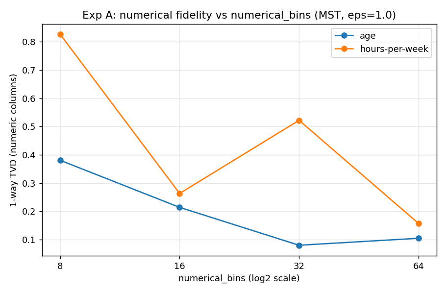
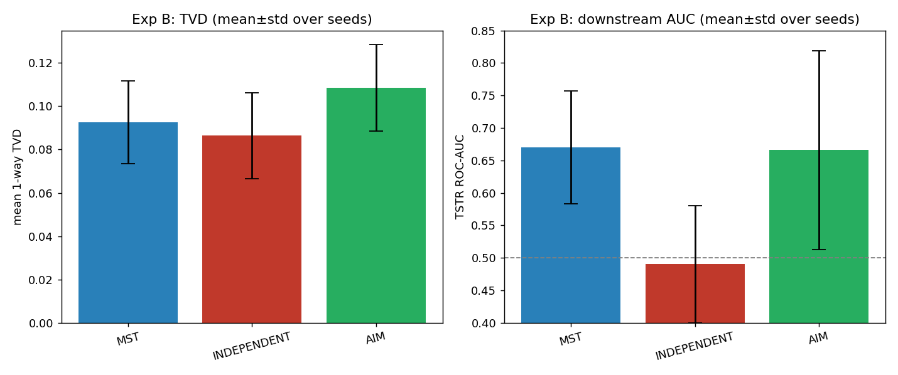
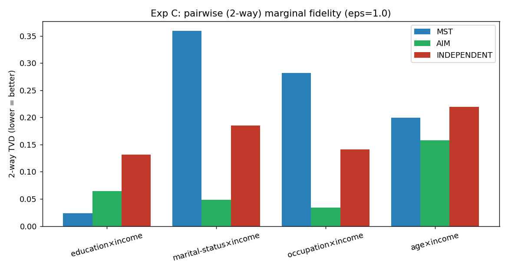

# 追加実験: DPSynth の挙動を深掘りする

本ページは [メインレポート](REPORT.md) の発見を掘り下げる追加実験です。
**スコープはメインと同じく In-Memory DataFrame API のみ**(Apache Beam 系は対象外)。
データ・サンプリング・列・評価指標はメインと共通(UCI Adult、20,000 行サンプル、`seed=42`、δ=1e-5)。

> 🔎 **このページは全体が「考察」**（本デモの実測・分析・推定）。google/dpsynth のドキュメント記載ではありません。
> 事実とドキュメント記載の対応はメインレポートの第10章「参考文献」を参照。

> 数値は本実行環境([`requirements.txt`](requirements.txt) 固定、Python 3.12.3)での結果。
> 実験B が示す通り個々の値はシード/環境で揺れるため、**傾向**を読み取ってください。

---

## 実験A: `numerical_bins` と数値列の忠実度

メインの発見「数値列(特に `hours-per-week`)が誤差の主因」を受け、
連続値の離散化ビン数 `numerical_bins` を変えて数値列の 1-way TVD を測定(MST, ε=1.0)。

| numerical_bins | age TVD ↓ | hours-per-week TVD ↓ |
|---|---|---|
| 8  | 0.381 | 0.827 |
| 16 | 0.202 | 0.696 |
| **32** | 0.124 | **0.150** |
| 64 | 0.118 | 0.551 |

**所見**: `age`(なだらかな分布)はビンを増やすほど単調に改善する。一方 `hours-per-week`(40 時間に鋭く集中)は
**bins=32 で最小(0.150)になり、64 ではむしろ悪化(0.551)** する **U 字**を描いた。
ビンを増やすと分解能は上がるが、**セル数が増える分 1 セルあたりの DP ノイズが相対的に大きくなる**ため、
分布形状によっては最適なビン数が存在する。
→ **数値列は「列ごとに適切なビン数を選ぶ」ことが重要**(一律 32 などの既定値が常に最適とは限らない)。

---

## 実験B: マルチシード頑健性(数値の揺れの定量化)

メインの数値が単一シードで、再現環境では値が前後した件を受け、**seed を変えて mean±std** を測定(ε=1.0)。
MST / INDEPENDENT は 10 シード、AIM は計算コストのため 5 シード。

| 機構 | n(seeds) | 平均 1-way TVD | TSTR ROC-AUC |
|---|---|---|---|
| MST | 10 | 0.093 ± 0.019 | 0.670 ± 0.087 |
| INDEPENDENT | 10 | 0.086 ± 0.020 | 0.490 ± 0.090 |
| AIM | 5 | 0.109 ± 0.020 | 0.666 ± 0.153 |

**所見**:
- **平均 1-way TVD は 3 機構で同程度(0.09〜0.11)**。これは数値列の誤差が全機構で支配的なため(実験A参照)。
  1-way TVD だけでは機構の優劣はほとんど判別できない。
- **TSTR AUC は MST(0.670)≈ AIM(0.666)> INDEPENDENT(0.490)** の順。
  シード数を増やすと **MST と AIM はほぼ同等**(差 0.004、いずれも標準偏差 ±0.09〜0.15 より小さい)で、
  優劣はシード次第で逆転しうる。一方 **INDEPENDENT は一貫して最下位**(相関を捨てる構造的弱点)。
- 標準偏差が依然大きい(±0.09〜0.15)ことが、**「単一シードの数値を鵜呑みにせず、複数シード平均で比較すべき」**という
  メインの再現性注意を定量的に裏付ける。シードを 5→10(AIM 3→5)に増やしても区間は十分には縮まっておらず、
  機構間の小さな差を論じるにはさらなる試行が要る。

---

## 実験C: 2-way(ペア)周辺分布の忠実度

1-way が揃っていても相関が保たれるとは限らない。属性ペアの**同時分布**の TVD を測定し、
相関保持力を直接比較した(ε=1.0、メインで生成済みの合成データを再利用)。

| 属性ペア | MST ↓ | AIM ↓ | INDEPENDENT ↓ |
|---|---|---|---|
| education × income | **0.041** | 0.047 | 0.132 |
| marital-status × income | 0.364 | **0.034** | 0.187 |
| occupation × income | 0.285 | **0.041** | 0.139 |
| age × income | 0.202 | **0.147** | 0.200 |

**所見**:
- **AIM が全ペアで最良**(0.03〜0.15)。ワークロードに応じて有用なマージナルを適応選択するため、
  ペア相関を広く保てる。
- **MST はペアによって明暗が分かれる**。`education×income` は良い(0.041)が、
  `marital-status×income`(0.364)・`occupation×income`(0.285)は**大きく崩れる**。
  MST は相関の**最大全域木(1 本の木)**しかモデル化しないため、**木に載らないペアの同時分布は保たれにくい**。
- 興味深いことに、これらのペアでは **INDEPENDENT(0.187 / 0.139)の方が MST より良い**。
  「全ペアを独立と仮定する」素朴さが、MST の木が張る**誤った相関**より結果的にマシになる場合がある。
- 教訓: **「どのペア相関が重要か」が決まっているなら AIM(または該当ペアを含むワークロード指定)が有利**。
  MST は高速だが、関心のあるペアが全域木から外れると 2-way 忠実度を落とす。

---

## 実験D: メンバーシップ推論攻撃(MIA)による経験的プライバシー評価

DP は理論的に「個人の有無が出力をほとんど変えない」ことを保証する。これを**経験的にも確かめる**ため、
標準的な距離ベースの**メンバーシップ推論攻撃(MIA)**を行った。

- **メンバー**(合成元の 20k に含む実レコード)と **非メンバー**(未使用の holdout 実レコード)を各 2,000 件用意。
- 各レコードの **合成データへの最近傍距離** をスコアに、メンバー/非メンバーを当てる **ROC-AUC** を測る。
  **AUC ≈ 0.5 なら個人の有無は漏れていない(= 安全)**。
- **対照**として「合成データ = 訓練データそのもの(非DPのコピー)」を入れる。これは漏洩するはずで、攻撃が機能する証拠になる。

| 合成データ | MIA AUC ↓(0.5 ≒ 安全) |
|---|---|
| **copy (非DP・対照)** | **0.893** |
| MST ε=1 | 0.516 |
| AIM ε=1 | 0.510 |
| INDEPENDENT ε=1 | 0.511 |
| MST ε=0.5 | 0.518 |
| MST ε=2 | 0.518 |
| MST ε=10 | 0.512 |

**所見**:
- **非DPのコピーは AUC 0.893** と明確に攻撃可能(攻撃が機能している証拠)。
  ※ 1.0 に届かないのは、9 列に絞ると**自然な重複レコード**が多く、非メンバーにも一致先が偶然存在するため。
- **DP 合成データはすべて AUC ≈ 0.51** と **0.5(漏洩なし)にほぼ張り付く**。
  機構・ε によらず**メンバーシップの手がかりはほぼゼロ**で、マージナル(集計統計量)からのみ生成する DP 合成の安全性が経験的に裏づけられた。
- ε による差はほとんど出ない(0.51〜0.52)。これらの ε では**既に漏洩信号が下限(0.5)付近に達している**ため。
- **注釈: 現状は距離型 MIA の結果であり、シャドウモデル型 MIA は未実施**(計算が重いため backlog)。
  距離型は平均的・比較的弱い攻撃で、外れ値個人を狙う最悪ケース評価ではない。これは1種類の経験的チェックであり、
  **DP の理論保証(`(ε, δ)`)を置き換えるものではない**。
- ε による差が出ないのも距離型の弱さゆえで、ε–安全性のトレードオフを精査するにはシャドウモデル型が必要。

---

## 補足: 数値離散化への汎用的な向き合い方(実験Aの含意)

実験Aで見た通り、`hours-per-week` のような尖った分布は**ビンを増やすほど良いわけではない**(セルが増えると 1 セルあたりの DP ノイズが増す)。
ただし**列ごとに最適ビンを手で合わせるのはデモとして不適切**(過剰適合)なので、汎用的な指針として:

- **既定は分位(等頻度)ビンのまま**。dpsynth の `numerical_bins` がそのまま汎用レバー。
- **bins は "n·ε(データ量×予算)" に応じて選ぶ**。中庸(16〜32)を基準に、データ・予算が潤沢なら増やす。タイトな予算で高ビンは逆効果。
- 真に適応的にしたいなら、列ごとに DP でビン境界を決める **dpsynth 自身の `dp_auto_discretizer`(分散側)** が筋。これは個別最適化ではなく**汎用機構**だが重いので、本デモのスコープ外(backlog)。

---

## まとめ(追加実験から)

1. **数値列はビン数のチューニングが効く**。分布が尖っている列ほど、ビン過多は DP ノイズで逆効果(実験A)。汎用的には「分位ビン+ n·ε に応じた中庸なビン数」。
2. **機構比較は複数シード平均で**。1-way TVD は機構差を捉えにくく、TSTR はばらつきが大きい(実験B)。
3. **相関保持は AIM > INDEPENDENT ≳/≈ MST(ペア依存)**。MST の全域木制約は、関心ペアが木から外れると弱点になる(実験C)。
4. **DP 合成データは MIA に耐える**。非DPコピーが AUC 0.89 で攻撃される一方、DP 合成は ≈0.5 で漏洩信号がほぼ無い(実験D)。

これらは「**機構選択は目的(どの相関・どの下流タスクを重視するか)で決まる**」「**DP は有用性と引き換えに経験的にもプライバシーを守る**」という DP 合成データの実務的な勘所を示している。

---

← [メインレポートに戻る](REPORT.md)
