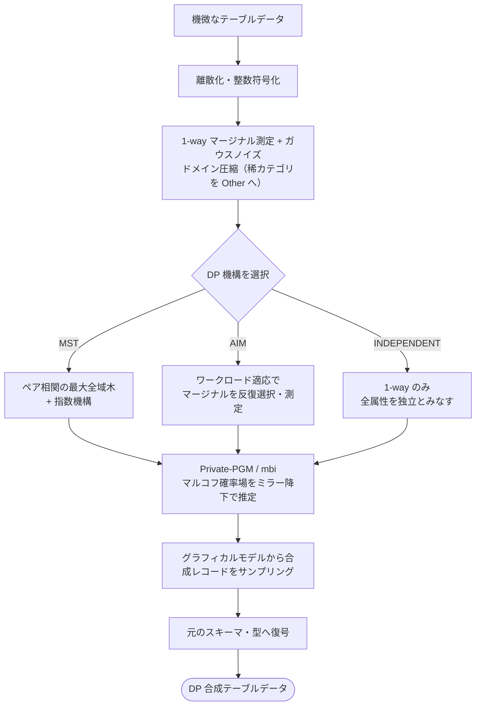
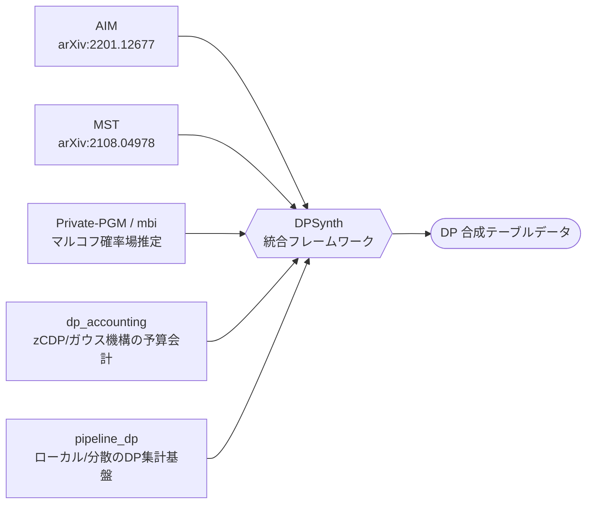

# DPSynth 解説・利用例・メリット/デメリット・実証デモ レポート

対象リポジトリ: **[google/dpsynth](https://github.com/google/dpsynth)** — *Differentially Private Synthetic Tabular Data Generation*
作成日: 2026-06-02 ／ 実行環境: WSL2 (Ubuntu 24.04) + Python 3.12 + uv

> **⚠️ 本デモ・実験のスコープ**
> - **対象データ形式**: **1 行 = 1 人の単表マスターデータ**(本デモの Adult がこれ)。dpsynth は「単一フラット表 + 各行が独立したプライバシー単位」を前提とする。**列間の相関は保つ**が、**トランザクション(1人=多数行・時系列)や複数テーブル(マスター–トランザクション)は前提が異なり対象外**(詳細は §2.5)。
> - **実行範囲**: **In-Memory DataFrame API(`dpsynth.generate`)のみ**。**Apache Beam の Scalable Pipeline API(分散処理)は対象外**(§2.1・§3.3 で機能紹介のみ。実行・評価はせず)。

---

> 📑 **凡例: 出典と考察の区別**
> - 本文中の出典タグ **[n]**(例 [\[3\]](#ref3))… google/dpsynth のドキュメント・論文・ソースに基づく**事実**。クリックで末尾の **付録C** の該当出典へ飛びます。
> - 🔎 **考察** … 出典タグの**無い**記述で、本デモの**実測・分析・推定・意見**(一次情報)。節が丸ごと考察の場合は見出し直下に 🔎 を付けます。

---

## 0. エグゼクティブサマリ

- **DPSynth とは**: 機微なテーブルデータから、**差分プライバシー (Differential Privacy, DP)** を数学的に保証しつつ、
  元データの統計的性質(分布・相関)を保った**合成データ**を生成する Google 製 OSS ライブラリ。
- **核となる技術**: 周辺分布(マージナル)ベースの DP 機構 **AIM / MST / SWIFT / INDEPENDENT** と、
  グラフィカルモデル推定 **Private-PGM**(マルコフ確率場のミラー降下推定)の組み合わせ。
- **2 つの実行系**: 単一マシン向け **In-Memory API**(Pandas)と、大規模分散向け **Scalable Pipeline API**(Apache Beam / `pipeline_dp`)。
  **本デモが扱うのは前者(In-Memory)のみ**で、Beam による分散処理は対象外。
- **本デモの結論**: UCI Adult Income データ(48,842 行)を **In-Memory API** で実際に生成・評価。
  カテゴリ列の分布は ε=1.0 でほぼ忠実に再現でき、相関を捉える MST/AIM は下流の機械学習タスク(収入予測)で
  相関を捨てる INDEPENDENT を大きく上回った。一方、**数値列の離散化精度**や **研究段階ゆえの実装の粗さ**(後述の実バグ)など、
  実運用には注意点もある。

---

## 1. DPSynth とは何か

### 1.1 解決する課題

医療・金融・人事などの**機微なテーブルデータ**は、分析・テスト・モデル学習に使いたくても、
個人のプライバシーリスクのため共有が難しい。従来の匿名化(マスキング、`k`-匿名化)は、
外部データとの**リンケージ攻撃**に脆弱であることが知られている [\[2\]](#ref2)。

DPSynth は、元データの代わりに**「個々のレコードの有無が出力にほとんど影響しない」ことを数学的に保証(差分プライバシー)した合成データ**を生成する。
合成データは元の個人を復元できないため、比較的自由に共有・公開・分析できる。

### 1.2 差分プライバシー (ε, δ) の直感

差分プライバシーは「ある 1 人を加えても/除いても、アルゴリズムの出力分布がほとんど変わらない」ことを保証する。

- **ε(イプシロン, プライバシー予算)**: 小さいほど強いプライバシー(=ノイズ大、有用性は下がる)。大きいほど有用性重視。
- **δ(デルタ)**: 保証がごく稀に破れる確率。通常 `1e-5`〜`1e-9` 程度の極小値。

DPSynth では生成 1 回あたりの**総予算 (ε, δ)** を指定し、内部で各測定(マージナル測定・ドメイン圧縮・機構実行)に予算を配分する。

### 1.3 仕組み(なぜ「合成」できるのか)

DPSynth の中核は **「低次元の周辺分布(1-way / 2-way マージナル)を DP 付きで測定し、それらと整合する同時分布をグラフィカルモデルで推定 → サンプリング」** という流れ [\[5\]](#ref5)[\[10\]](#ref10)。
個々のレコードを覚えるのではなく、**ノイズを加えた集計統計量だけ**からモデルを作るため、DP が成立する。

#### データ合成プロセス(mermaid)



#### コンセプト: 既存手法の「組み合わせ」

DPSynth は新しい DP アルゴリズムを発明したというより、**マージナル選択機構(AIM/MST)+ グラフィカルモデル推定(Private-PGM)+ DP 予算会計 + 分散集計基盤**という
**既存の確立した部品を統合**したフレームワークである [\[1\]](#ref1)[\[8\]](#ref8)[\[9\]](#ref9)[\[10\]](#ref10)。



> どの機構を選んでも推定エンジンは共通の **Private-PGM(`mbi`)**。機構は「**どのマージナルをどう測るか**」の戦略の違い、と捉えると見通しが良い。

### 1.5 コントリビューション(新規性)の位置づけ

> 🔎 **考察**（ドキュメントに明示は無く、コード/ドキュメント構造からの筆者の推定・解釈）。

> DPSynth には論文が無く、README も「公式サポート対象外」と明記している。以下はコードとドキュメント構造からの整理であり、推定を含む。

結論から言うと、**DPSynth の新規性は「新しい DP アルゴリズムの発明」ではなく、既存手法の"プロダクト化・スケール化"**にある。

**新規ではない部分(既存のもの)**

- **AIM**(arXiv:2201.12677)・**MST**(arXiv:2108.04978) … McKenna らの既発表アルゴリズム
- **Private-PGM(`mbi`)** … 同じく McKenna の既存ライブラリ(マルコフ確率場推定)
- **`dp_accounting`**(予算会計)・**`pipeline_dp`**(DP 集計基盤) … Google の既存ライブラリ

→ 「マージナルを測る → グラフィカルモデルで同時分布を推定 → サンプリング」という**手法自体は新しくない**(docs でも AIM/MST には arXiv 引用が付く)。

**実際のコントリビューション(システム/エンジニアリングの貢献)**

1. **分散・大規模実行(最大の貢献)**: AIM/MST/Private-PGM の参照実装(`mbi`)は**単一マシン・インメモリ専用**。DPSynth は同じ処理を `pipeline_dp.PipelineBackend` に対して**再実装**し、**Apache Beam / Spark でクラスタ分散**できるようにした(`pipeline_transformations/` が独自部分の主体)。「研究コードでは回らない規模」を回せる。
2. **同一 API でローカル↔分散の両対応**: `LocalBackend` と `BeamBackend` を同じ抽象の裏に置き、書き方を変えずスケールだけ変えられる。
3. **生データからの end-to-end 化**: 研究コードは「離散化済み・ドメイン既知」を前提とするが、DPSynth は**生の機微データから数値列の分位点を DP で推定し、オープン集合カテゴリを DP パーティション選択で発見**する "population phase" を持つ(これ自体も予算を消費する DP 処理)。CSV/Proto/TFRecord/SQL の差は `DatasetDescriptor` で吸収。
4. **付随インフラ**: ドメイン圧縮(稀カテゴリ→Other)、cross-attribute constraints、診断情報、**評価フレームワーク(`eval/`)** を統合。
5. **SWIFT(唯一の"新規アルゴリズム"候補)**: docs で AIM/MST には arXiv があるのに **SWIFT だけ引用が無く**「advanced, highly optimized mechanism for scalable synthesis」とだけ記される。ローカル/分散の両方に実装があり、**外部論文が見当たらない=本ライブラリ独自(あるいは未公開)の機構の可能性**。ここだけは algorithmic な新規性かもしれない(断定は不可)。

**一言で**: **「SOTA のマージナルベース DP 合成(AIM/MST/Private-PGM)を、研究コードの単一マシンの檻から出し、生データ対応・分散スケール・統一 API・評価込みの"使える基盤"へ整備した」**のが貢献。新しい定理やメカニズムではなく、**インフラ/ワークフローとしての貢献**(例外候補は SWIFT)。

---

## 2. アーキテクチャと対応アルゴリズム

### 2.1 2 つの実行モデル

DPSynth は規模に応じて 2 つの実行系を提供する [\[2\]](#ref2)。

| | In-Memory DataFrame API | Scalable Pipeline API |
|---|---|---|
| 入出力 | Pandas DataFrame | シャーディングされたファイル / SQL / TFRecord |
| 実行基盤 | 単一マシン RAM (`pipeline_dp.LocalBackend`) | Apache Beam / Spark (`pipeline_dp.BeamBackend`) |
| 想定規模 | 数千〜数百万行 | 大規模クラスタ・超大規模データ |
| エントリ | `dpsynth.generate()` / `bin/main.py` (CLI) | `dpsynth.data_generation.generate()` / `bin/run_data_generation.py` |
| 用途 | 研究・プロトタイピング | 本番データパイプライン |
| 本デモの対象 | ✅ **対象**（以降の実験はすべてこちら） | ❌ 対象外（紹介のみ） |

> 以降の §6 デモ・評価は **In-Memory DataFrame API のみ**で実施しており、Apache Beam 系の API は実行していません。

### 2.2 処理ライフサイクル(In-Memory の 5 段階)

`dpsynth.generate()` 内部は以下の 5 段階で動く [\[5\]](#ref5)[\[11\]](#ref11)。

1. **離散化 (Discretization)**: 連続値は等頻度分位ビンに、オープン集合の文字列は DP パーティション選択で評価。
2. **整数符号化 (Integer Encoding)**: 全列を密な整数インデックス `[0, K-1]` に写像。
3. **ドメイン圧縮 (Compression)**: 1-way マージナルをガウスノイズ付きで測定し、稀なカテゴリを `"Other"` にまとめる。
4. **機構実行 (Mechanism)**: AIM / MST 等を実行。`mbi.MarkovRandomField` を Private-PGM のミラー降下で当てはめる。
5. **サンプリング & 逆変換**: グラフィカルモデルから合成整数レコードを生成し、元の型(文字列・整数・浮動小数)へ復号。

### 2.3 対応アルゴリズム

DPSynth は次の機構をサポートする [\[3\]](#ref3)。

| 機構 | 概要 | 特徴 |
|---|---|---|
| **AIM** (Adaptive Iterative Mechanism) | ワークロード・予算・データ特性に基づき**低次元マージナルを適応的に選択・測定**する MWEM 系手法 [\[8\]](#ref8) | 下流タスクに効く相関を優先的に捉えやすい。計算コストは高め |
| **MST** (Maximum Spanning Tree) | 指数機構で**ペア相関の最大全域木**を選び、2 変量依存を DP でモデル化 [\[9\]](#ref9) | 高速で頑健。多くのケースで良いベースライン |
| **SWIFT** | スケーラブルに複雑なカテゴリ/数値分布を扱う最適化機構(外部論文は確認できず、独自の可能性) | 大規模向け |
| **INDEPENDENT** | 1-way マージナルのみ測定し**全属性を独立**にモデル化 | 最も単純なベースライン。相関は一切保たれない |

いずれも推定エンジンとして **Private-PGM**([`mbi`](https://github.com/ryan112358/mbi))を共有する [\[10\]](#ref10)。

### 2.4 属性型(スキーマ定義)

DPSynth は各列を 3 つの属性型のいずれかとして扱う [\[6\]](#ref6)。

| 型 | 用途 | 例 |
|---|---|---|
| `CategoricalAttribute` | 取りうる値が既知の有限カテゴリ | 曜日、都道府県、真偽フラグ |
| `OpenSetCategoricalAttribute` | カテゴリ集合が未知/非有界(DP で値を発見) | 職種名、都市名 |
| `NumericalAttribute` | 連続値 or 順序付き整数(範囲指定) | 年齢、給与、取引額 |

### 2.5 対象データの形式と「保存される特徴」

> 🔎 **考察を含む**（前提は出典付きの事実、各データ形式への当てはめは筆者の評価)。

dpsynth の前提は **「単一フラット表(single-table schema)+ 各行が独立したプライバシー単位」** [\[1\]](#ref1)[\[6\]](#ref6)。
列はスカラーのみで、**繰り返し/ネスト列や union は非対応**(解析時に無視される)[\[6\]](#ref6)。
**「各レコードは異なるプライバシー単位から来る」ことを仮定**する [\[6\]](#ref6)。
この前提を実データの形式に当てはめると(🔎 考察):

| 対象データ | 可否 | 保存される / されない構造 |
|---|---|---|
| **単表マスター**(1行=1エンティティ。顧客・商品マスタ) | ✅ **本命**(本デモの Adult がこれ) | 列の**同時分布(相関)・型**を保つ |
| **単表トランザクション**(1行=1イベント) | ⚠️ **限定的** | 各行の**属性分布は保てる**が、**時間順・エンティティ別の系列・エンティティあたり件数(カーディナリティ)は保たない**。さらに「**1人=多数行**」だと**行レベル DP の前提が崩れ**、保証の単位が実質「トランザクション」になり**個人単位のプライバシーが弱くなる**(寄与上限/グループ DP が別途必要) |
| **マスター–トランザクション**(複数テーブル・FK) | ❌ **非対応** | FK・参照整合性・親子カーディナリティ・表間相関は扱えない(→ リレーショナル合成器の領域) |
| 時系列 / グラフ | ❌ 範囲外 | 順序・自己相関・ネットワーク構造は対象外 |

**要点**: dpsynth は「**1 行 = 1 人の単表の、列間相関を保つ**」手法。トランザクションや複数テーブルは
「入る/入らない」以前に**保たれる構造が違う**ため、用途が変わる。自分のデータが上のどれかを最初に見極めるとよい。

---

## 3. 使い方(API)

### 3.1 In-Memory API: `dpsynth.generate`

```python
import dpsynth
from dpsynth import discrete_mechanisms as dm
from dpsynth import domain
import pandas as pd

df = pd.read_csv("sensitive.csv")

domains = {
    "age": domain.NumericalAttribute(min_value=17, max_value=90, dtype="int", clip_to_range=True),
    "education": domain.CategoricalAttribute(possible_values=sorted(df["education"].unique())),
    "occupation": domain.OpenSetCategoricalAttribute(default_value="Unknown"),
}

synthetic = dpsynth.generate(
    data=df,
    domains=domains,
    epsilon=1.0,
    delta=1e-5,
    discrete_config=dm.MSTConfig(seed=42),   # or AIMConfig / IndependentConfig
    numerical_bins=16,
)
synthetic.to_csv("synthetic.csv", index=False)
```

主な引数 [\[4\]](#ref4): `epsilon` / `delta`(総予算)、`discrete_config`(機構)、`numerical_bins`(数値ビン数)、
`one_way_marginal_budget_fraction`(1-way 測定+圧縮に割く予算割合)、`cross_attribute_constraints`(列間制約)、`skip_compression`。

### 3.2 ドメイン定義(YAML)とCLI

YAML の解釈規則と CLI フラグは公式ドキュメント準拠 [\[6\]](#ref6)[\[4\]](#ref4)。

```yaml
# domain.yaml : possible_values→Categorical / min_value+max_value→Numerical / 空→OpenSet
workclass:
  possible_values: ["?", "Private", "Self-emp-not-inc", "Federal-gov"]
  out_of_domain_index: 0
age:
  min_value: 17.0
  max_value: 90.0
  dtype: "int"
  clip_to_range: true
occupation: {}
```

```bash
python3 bin/main.py \
  --dataset=data.csv --domain=domain.yaml \
  --epsilon=1.0 --delta=1e-8 \
  --mechanism=mst --seed=12345 \
  --output_path=/tmp/synthetic.csv
# --mechanism: mst | aim | independent | aim_gdp
```

### 3.3 Scalable Beam API

分散実行は `data_generation.generate` + `BeamBackend` を用いる [\[7\]](#ref7)。

```python
import apache_beam as beam
from dpsynth import data_generation
from dpsynth.dataset_descriptors import csv_descriptor
import pipeline_dp

config = data_generation.DataGenerationConfig(
    epsilon=1.0, delta=1e-5,
    mechanism=data_generation.Mechanism.MST,
    dataset_descriptor=descriptor,
    num_out_records=1000,
)
with beam.Pipeline() as p:
    records = p | beam.io.ReadFromText("adult.csv", skip_header_lines=1) | beam.Map(parse)
    synthetic = data_generation.generate(input_data=records, config=config, backend=pipeline_dp.BeamBackend())
```

---

## 4. 利用例(ユースケース)

> 🔎 **考察**（一般的な DP 合成データの用途を筆者が整理したもの。特定ドキュメントの記載ではない）。

1. **データ共有・公開**: 機微な顧客/患者データの代わりに、分析可能な合成版を社外・研究者・オープンデータとして提供。
2. **開発/テスト/CI 用データ**: 本番データを使えない開発環境やステージングに、本物らしい合成データを供給。
3. **ML モデルの事前学習・データ拡張**: 機微データから合成データを作り、モデル学習やプロトタイピングに利用。
4. **部門間・第三者ベンダー連携**: 規制(個人情報保護法 / GDPR / HIPAA 等)下での安全なデータ受け渡し。
5. **データカタログ/デモ環境**: 実データのスキーマと統計を保ったサンプルを安全に提示。
6. **プライバシー保護下の統計公開**: 集計・ダッシュボード用に、DP 保証付きの合成テーブルを配布。

---

## 5. メリット / デメリット

### メリット

- **数学的なプライバシー保証**: ヒューリスティックな匿名化と違い `(ε, δ)`-DP を満たす。リンケージ攻撃に強い。
- **相関・同時分布の保持**: MST/AIM は属性間の相関を捉え、単純な独立サンプリングより遥かに有用なデータを作る(本デモで実証)。
- **スキーマ・型の維持**: 出力は元データと同じ列・型なので、既存パイプラインにそのまま流せる。
- **スケール両対応**: 小規模(Pandas)から超大規模(Beam/Spark)まで同一概念で扱える。
- **DP 合成の SOTA を実装**: AIM/MST/Private-PGM は DP 合成データ研究のベンチマークで上位の手法群。
- **予算で有用性を制御可能**: ε を上げ下げしてプライバシーと有用性のトレードオフを調整できる。

### デメリット / 注意点

- **非公式・研究段階**: 「公式サポート対象外の Google プロダクト」と明記され、脆弱性報奨制度の対象外 [\[13\]](#ref13)。
  実際、本デモでも **INDEPENDENT 機構が新しい `mbi` と非互換でクラッシュ**(後述)するなど、実装の粗さに遭遇した(🔎 考察)。
- **依存とプラットフォーム制約**: `pipeline-dp` → `python-dp` は **Windows ホイール無し**・Python `>=3.12,<3.14` 限定。
  Windows ネイティブでは動かず、Linux / WSL / macOS が必須。
- **数値列の忠実度**: 連続値は分位ビンへ離散化されるため、`hours-per-week` のような一点集中分布では再現精度が落ちやすい(本デモで確認)。
- **計算コスト**: AIM は反復・PGM 推定が重く、列数・ラウンド数次第で時間がかかる。
- **小さい ε での不安定性**: 極端に強いプライバシー(本デモの ε=0.1)ではノイズ較正が破綻し例外になるケースがあった。
- **ドキュメント/パッケージングの未整備**: サブパッケージの `__init__.py` 欠落など、そのままでは `pip install` 後に import 不能な箇所がある。
- **有用性の上限**: DP ノイズの分だけ、下流タスク性能は実データ学習(本デモ TRTR)に届かない。

---

## 6. 実証デモ: UCI Adult Income で生成・評価

> 🔎 **考察**（本デモの実測・分析。数値は `outputs/metrics.json` の一次情報で、ドキュメント記載ではない）。

### 6.1 設定

- **実行系**: **In-Memory DataFrame API(`dpsynth.generate`)のみ**。Apache Beam / Scalable Pipeline API は本デモの対象外。
- **データ**: UCI Adult Income(48,842 行)から **20,000 行**をサンプリングして合成元に使用(`seed=42`)。
- **対象列(9 列)**: 数値 `age`, `hours-per-week` ／ カテゴリ `workclass, education, marital-status, occupation, race, gender, income`。
- **機構比較 (ε=1.0, δ=1e-5)**: MST / AIM / INDEPENDENT。
- **予算スイープ (MST)**: ε = 0.5 / 1.0 / 2.0 / 10.0。
- **評価指標**:
  - **1-way TVD** — 各列の分布差(Total Variation Distance、小さいほど良い)。
  - **相関誤差** — 数値ペアの Pearson 相関係数の絶対誤差。
  - **TSTR** (Train on Synthetic, Test on Real) — 合成データで `income>50K` 二値分類器(勾配ブースティング)を学習し、
    **未使用の実データ 8,000 行**で評価。実データ学習の **TRTR** を上限ベースラインとする。

<!--RESULTS_START-->
### 6.2 結果サマリ

| 設定 | 平均 1-way TVD ↓ | 相関誤差 ↓ | TSTR AUC ↑ | TSTR 正解率 | TSTR F1 | 生成時間 |
|---|---|---|---|---|---|---|
| **MST** (ε=1.0) | 0.098 | **0.064** | 0.687 | 0.723 | 0.427 | 約 10 秒 |
| **AIM** (ε=1.0) | **0.105** | 0.226 | **0.768** | 0.754 | 0.505 | 約 90 秒 |
| **INDEPENDENT** (ε=1.0) | 0.106 | 0.077 | 0.433 | 0.759 | 0.003 | 約 6 秒 |
| MST (ε=0.5) | 0.120 | 0.084 | 0.655 | 0.721 | 0.460 | 約 10 秒 |
| MST (ε=2.0) | 0.110 | 0.069 | 0.642 | 0.734 | 0.403 | 約 7 秒 |
| MST (ε=10.0) | **0.059** | 0.070 | 0.681 | 0.745 | 0.402 | 約 9 秒 |
| *TRTR 上限(実データ学習)* | *—* | *—* | *0.893* | *0.841* | *0.625* | *—* |

太字は各指標の最良値。TSTR は「合成データで学習→未使用の実データ 8,000 行で評価」した収入予測(`income>50K`)の性能。

> **再現性についての注意**: 上表は **特定の依存バージョン・単一シード(`seed=42`)での代表的な 1 実行**の結果です。
> `setup_env.sh` による新規インストールでは `jax` / `mbi` 等のバージョン差で乱数列が変わり、**個々の数値は多少前後します**
> (実測でも別環境で MST の平均 TVD が 0.098→0.109、INDEPENDENT の TSTR AUC が 0.433→0.546 などの変動を確認)。
> ただし下記の **定性的傾向(機構の優劣・トレードオフの向き)は再現される**ため、結論はそちらに基づきます。
> 厳密な数値比較を行う場合は依存バージョンを固定し、複数シードで平均を取ることを推奨します。

### 6.3 主要な所見

**(1) カテゴリ列はほぼ忠実、数値列が誤差の主因。**
ε=1.0 では `workclass / education / marital-status / occupation / race / gender / income` の 1-way TVD は
いずれも概ね **0.03 以下**(MST/AIM とも)。一方、数値列は離散化の影響で TVD が大きく、特に
`hours-per-week`(40 時間に一点集中する分布)は **TVD ≈ 0.6** と再現が難しかった。
→ **数値列が多いデータでは `numerical_bins` の調整や前処理が重要**。

**(2) 相関を捨てる INDEPENDENT は下流タスクで明確に劣る。**
INDEPENDENT は 1-way 分布こそ良好(平均 TVD 0.106)だが、**特徴量と収入の相関を一切保たない**ため、
下流の収入予測では一貫して最下位になる。本実行例では TSTR AUC **0.433(ランダム以下)・F1 ≈ 0**(全員 `<=50K` と予測)まで落ち込み、
別環境でも 0.55 前後と、相関を保つ機構に明確に劣った。
これは「**1-way 分布の一致 ≠ 有用性**」「相関のモデル化が下流タスクに不可欠」という DP 合成の核心を示している。
本実行例では MST(AUC 0.687)・AIM(AUC 0.768)が相関を捉えて大きく上回った(機構の優劣 **AIM > MST > INDEPENDENT** はどの環境でも再現)。

**(3) AIM はワークロード適応で下流性能が最良、ただしコストとチューニング依存。**
AIM はマージナルを適応選択するため TSTR AUC が最良(0.768、TRTR 上限 0.893 に最も接近)。
ただし計算は重く(約 90 秒)、**ラウンド数の影響が大きい**。本デモでは `max_rounds=8` だと
`education` の 1-way TVD が 0.40 と悪化したが、`max_rounds=16` に増やすと **0.03 まで改善**した。

**(4) プライバシー予算 ε のトレードオフ。**
MST の平均 1-way TVD は ε とともに概ね改善(ε=0.5:0.120 → ε=1.0:0.098 → ε=10.0:0.059)。
ε=2.0 がわずかに悪化しているのは**単一シードの確率的ばらつき**で、厳密な傾向把握には複数シード平均が望ましい。
TSTR AUC も同様に単一シードのため非単調だが、強プライバシー(ε=0.5)が最も不利な点は一貫している。

### 6.4 図

**図1: 機構別の列ごと 1-way TVD(ε=1.0)** — カテゴリ列は全機構で低誤差、数値列(age, hours-per-week)が支配的。


**図2: プライバシー–有用性トレードオフ(MST)** — ε を上げるほど平均 TVD は概ね低下。


**図3: 分布再現の例(education, ε=1.0)** — real とほぼ重なる各機構。カテゴリ分布の高再現性を可視化。


**図4: 下流ユーティリティ TSTR AUC** — 相関を保つ MST/AIM が INDEPENDENT を圧倒、AIM が TRTR 上限に最接近。


### 6.5 経験的プライバシー: メンバーシップ推論攻撃(MIA)

DP は理論上「個人の有無が出力をほとんど変えない」ことを保証する。これを**経験的にも確認**するため、
標準的な**距離ベースの MIA** を実施した。メンバー(合成元に含む実レコード)と非メンバー(未使用の holdout)を、
「合成データへの最近傍距離」で当てられるかを **ROC-AUC** で測る(**0.5 ≒ 漏洩なし=安全**)。
対照として「合成データ＝訓練データそのもの(非DPのコピー)」を置く。


> **⚠️ 注釈**: 現状は**距離型 MIA の結果**であり、**シャドウモデル型 MIA は未実施**(計算が重いため backlog)。
> 距離型は平均的・比較的弱い攻撃で、外れ値個人を狙う最悪ケース評価ではない点に注意。

**所見**:
- **非DPのコピーは AUC 0.89** で明確に攻撃可能 → 攻撃が機能している証拠。一方 **DP 合成はすべて AUC ≈ 0.51** と
  0.5(漏洩なし)にほぼ張り付き、**マージナルからのみ生成する DP 合成の安全性が経験的に裏づけられた**。
- **ε–安全性のトレードオフは、この距離型攻撃では見えなかった**(ε=0.5〜10 のいずれも AUC≈0.51)。
  これらの ε では既に漏洩信号が下限付近にあり、差を出すには**より強い攻撃(シャドウ型)が必要**と考えられる。
  なお **ε–有用性のトレードオフ**は §6.2 表・図2・図4 に表れている(安全性ではなく有用性の側で観測される)。

詳細・他の追加実験は §6.6 / 別ページ参照。

### 6.6 追加実験(別ページ)

本体を簡潔に保つため、以下の深掘り検証は別ページにまとめています
（公開サイト上部の「🧪 追加実験」タブ、または [EXPERIMENTS.md](EXPERIMENTS.md)）。

- **実験A**: `numerical_bins` スイープ — 数値列の忠実度がビン数でどう変わるか
- **実験B**: マルチシード頑健性 — seed を変えたときの平均 TVD / TSTR AUC の mean±std（再現性の定量化）
- **実験C**: 2-way(ペア)周辺分布の忠実度 — 相関保持を定量化（INDEPENDENT の弱点を可視化）
- **実験D**: メンバーシップ推論攻撃(MIA) — DP の安全性を経験的に検証（非DPコピー 0.89 vs DP合成 ≈0.51）

---

## 7. 実運用で遭遇した「落とし穴」(再現される実問題)

> 🔎 **考察**（本デモの実行で遭遇した一次情報。該当コード位置は示すが、ドキュメントに書かれた仕様ではない）。

本デモは「とりあえず動く」状態にするまでに、以下の実問題に対処した。これは**ライブラリの成熟度を測る生きた情報**でもある。

1. **Windows で `python-dp` が入らない**: `pipeline-dp` の依存 `python-dp`(Google C++ DP ライブラリ)は
   Linux/macOS ホイールのみ。→ **WSL2 (Ubuntu) + Python 3.12** に切り替えて解決。
2. **`pip install` 後に import できない**: ルート以外のサブパッケージに `__init__.py` が無く、
   `dpsynth.pipeline_transformations` 等が同梱されない。→ 各ディレクトリに `__init__.py` を補って解決。
3. **未宣言の依存**: `tqdm` が `dependencies` に無く ImportError。→ 追加インストールで解決。
4. **INDEPENDENT 機構のクラッシュ**: `generate()` が常に渡す 1-way 測定値 [\[11\]](#ref11) の上に、INDEPENDENT が同じ 1-way を
   再測定する [\[12\]](#ref12) ため、`mbi` 新版の `CliqueVector.expand` が「Cliques must be unique」で例外。
   → `expand` へ渡すクリーク列を重複排除する **1 行修正**で解決(予算消費は不変)。
5. **小さい ε での会計破綻**: ε=0.1 でノイズ較正の区間探索が失敗(`NoBracketIntervalFoundError`)。
   → スイープを ε≥0.5 に調整。

> これらは「研究段階・非公式サポート」という位置づけを裏付ける。
> **PoC・研究用途には十分強力**だが、本番採用にはフォーク/パッチ管理と検証体制が前提となる。

---

## 8. まとめ

> 🔎 **考察**（本デモ全体の総括・筆者の評価）。

- DPSynth は **DP 合成テーブルデータ生成の最先端手法(AIM/MST/Private-PGM)を、In-Memory と Beam の両系で使える**実装。
- **カテゴリデータ中心**かつ**相関の保持が重要**な用途(下流 ML、分析共有)で特に価値が高い。
- 一方、**数値列の離散化精度**・**研究段階の実装品質**・**Linux 前提の依存**という制約があり、
  採用時はパッチ管理・評価(本デモのような TVD/相関/TSTR 検証)・予算設計をセットで行うべき。

---

## 付録 A. 再現手順(clone してコマンド実行で再現)

> **前提**: google/dpsynth は Windows ホイールの無い `python-dp` に依存し、Python は `>=3.12,<3.14`。
> そのため **Linux もしくは WSL2 (Ubuntu) + Python 3.12** で実行する(Windows ネイティブ不可)。
> Windows の場合は WSL を起動し、その中で以下を実行する。

```bash
# 1. リポジトリを取得
git clone https://github.com/gghatano/dpsynth-demo.git
cd dpsynth-demo

# 2. 環境構築（uv 導入・dpsynth クローン&パッチ・venv 作成・依存インストールまで一括）
bash scripts/setup_env.sh

# 3. 一括実行（データ取得 → DP 合成生成 → 評価 → レポート HTML 生成）
bash scripts/run_all.sh
```

実行後、`outputs/`(合成 CSV・`metrics.json`)、`figures/`(評価図)、`htmls/`(レポートHTML) が再生成される。
個別に動かす場合:

```bash
.venv/bin/python scripts/00_prepare_data.py   # Adult データ取得・整形（data/adult.csv）
.venv/bin/python scripts/01_generate.py       # 合成データ生成（MST/AIM/INDEPENDENT + ε スイープ）
.venv/bin/python scripts/02_evaluate.py       # 1-way TVD / 相関誤差 / TSTR と図
.venv/bin/python scripts/10_experiments.py    # 追加実験 A/B/C
.venv/bin/python scripts/11_mia.py            # 追加実験D（MIA）
.venv/bin/python scripts/03_build_html.py     # htmls/index.html・experiments.html
```

`setup_env.sh` が内部で行う上流対処（再現性のため明記）:

- `pyproject.toml` から `tensorflow` を除外(In-Memory デモには不要)
- サブパッケージ(`pipeline_transformations` 等)へ `__init__.py` を補完(パッケージング漏れ対策)
- INDEPENDENT 機構の重複クリーク・バグを [`patches/independent_dedup_cliques.patch`](https://github.com/gghatano/dpsynth-demo/blob/main/patches/independent_dedup_cliques.patch) で 1 行修正

詳細・トラブルシュートは [README](https://github.com/gghatano/dpsynth-demo/blob/main/README.md) を参照。

## 付録 B. 参考文献・リンク

- リポジトリ: https://github.com/google/dpsynth
- Private-PGM (`mbi`): https://github.com/ryan112358/mbi
- pipeline_dp: https://github.com/google/pipeline-dp
- AIM: McKenna et al., *AIM: An Adaptive and Iterative Mechanism for Differentially Private Synthetic Data* — [arXiv:2201.12677](https://arxiv.org/abs/2201.12677)
- MST: McKenna et al., *Winning the NIST Contest: A scalable and general approach to differentially private synthetic data* — [arXiv:2108.04978](https://arxiv.org/abs/2108.04978)

## 付録 C. 出典(本文の [n] はここを指す)

本文中の出典タグ **[n]** は以下を指す。`docs/` は [google/dpsynth/dpsynth/documentation/](https://github.com/google/dpsynth/tree/main/dpsynth/documentation)。
upstream ドキュメントは行アンカーが無いため、ページ内はセクション見出し名で位置を示す。

<a id="ref1"></a>**[1]** dpsynth **README**(リポジトリ直下)— "Core Concepts & Synthesis Lifecycle" / "Project Structure & Modules"。[README.md](https://github.com/google/dpsynth/blob/main/README.md)

<a id="ref2"></a>**[2]** **docs/index.md** — "Why DPSynth?"(匿名化の限界・DP の動機)/ "Core APIs and Execution Models"(In-Memory と Beam の 2 実行系)。[index.md](https://github.com/google/dpsynth/blob/main/dpsynth/documentation/index.md)

<a id="ref3"></a>**[3]** **docs/index.md** — "Supported Synthesis Algorithms"(AIM / MST / SWIFT / INDEPENDENT)。[index.md](https://github.com/google/dpsynth/blob/main/dpsynth/documentation/index.md)

<a id="ref4"></a>**[4]** **docs/in_memory_api.md** — "Function Signature"(`dpsynth.generate` の引数・既定値)。[in_memory_api.md](https://github.com/google/dpsynth/blob/main/dpsynth/documentation/in_memory_api.md)

<a id="ref5"></a>**[5]** **docs/in_memory_api.md** — "Under the Hood: The In-Memory Lifecycle"(離散化→符号化→圧縮→機構→復号の 5 段階)。/ [docs/processing_lifecycle.md](https://github.com/google/dpsynth/blob/main/dpsynth/documentation/processing_lifecycle.md)

<a id="ref6"></a>**[6]** **docs/data_and_terminology.md** — "Supported Attribute Classifications"(Categorical/OpenSet/Numerical)/ "Writing a domain.yaml"。[data_and_terminology.md](https://github.com/google/dpsynth/blob/main/dpsynth/documentation/data_and_terminology.md)

<a id="ref7"></a>**[7]** **docs/scalable_beam_api.md**(Scalable Pipeline / Beam API)/ [examples/quickstart.ipynb](https://github.com/google/dpsynth/blob/main/dpsynth/examples/quickstart.ipynb)。[scalable_beam_api.md](https://github.com/google/dpsynth/blob/main/dpsynth/documentation/scalable_beam_api.md)

<a id="ref8"></a>**[8]** **AIM** — McKenna et al., *AIM: An Adaptive and Iterative Mechanism for DP Synthetic Data*。[arXiv:2201.12677](https://arxiv.org/abs/2201.12677)

<a id="ref9"></a>**[9]** **MST** — McKenna et al., *Winning the NIST Contest*。[arXiv:2108.04978](https://arxiv.org/abs/2108.04978)

<a id="ref10"></a>**[10]** **Private-PGM / `mbi`** — McKenna, Sheldon, Miklau, *Graphical-model based estimation and inference for DP*, ICML 2019。[arXiv:1901.09136](https://arxiv.org/abs/1901.09136) / [mbi](https://github.com/ryan112358/mbi)

<a id="ref11"></a>**[11]** dpsynth ソース [`data_generation_v2.py`](https://github.com/google/dpsynth/blob/main/dpsynth/data_generation_v2.py)(1-way マージナル測定→ドメイン圧縮→機構実行→復号の実装)

<a id="ref12"></a>**[12]** dpsynth ソース [`discrete_mechanisms/independent.py`](https://github.com/google/dpsynth/blob/main/dpsynth/discrete_mechanisms/independent.py)(INDEPENDENT 機構。`expand` への重複クリーク)

<a id="ref13"></a>**[13]** dpsynth **README** 末尾 — "This is not an officially supported Google product"(非公式・サポート外)。[README.md](https://github.com/google/dpsynth/blob/main/README.md)

> §6・§7 の数値・不具合は upstream 文書ではなく、本デモの実行で得た一次情報(=🔎 考察)です。
