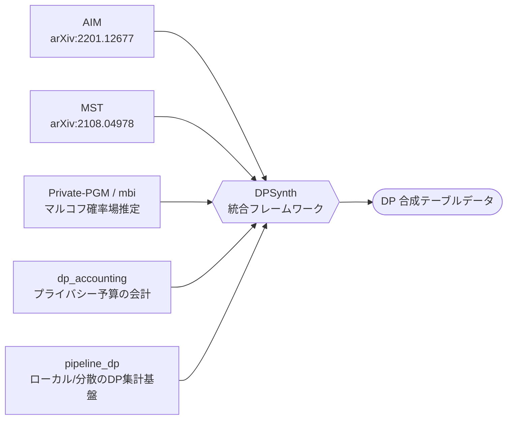
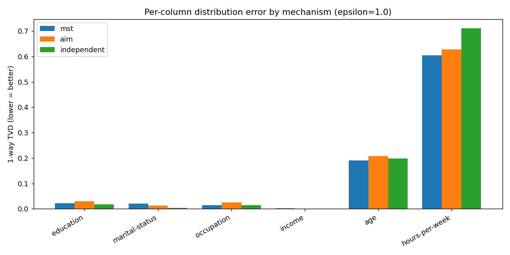
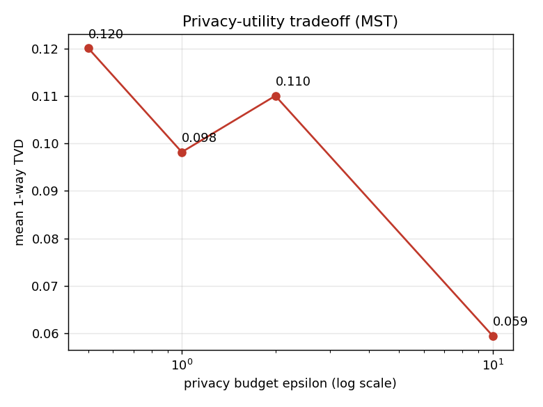
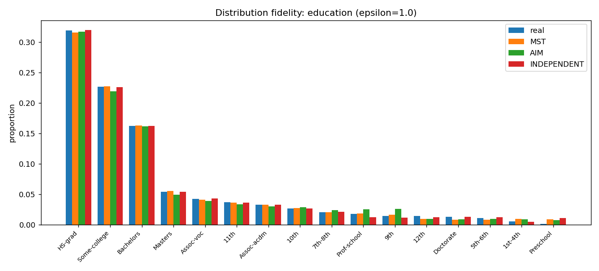
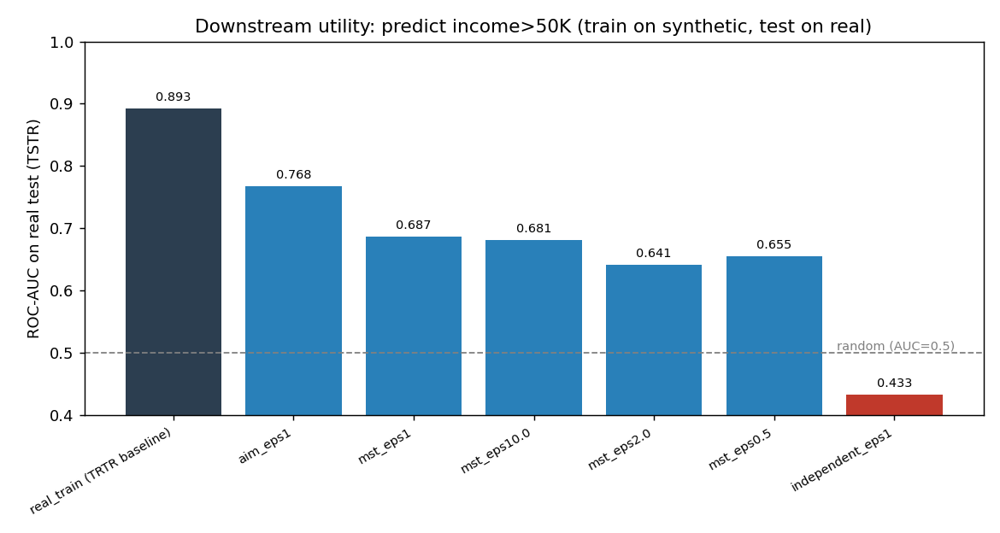
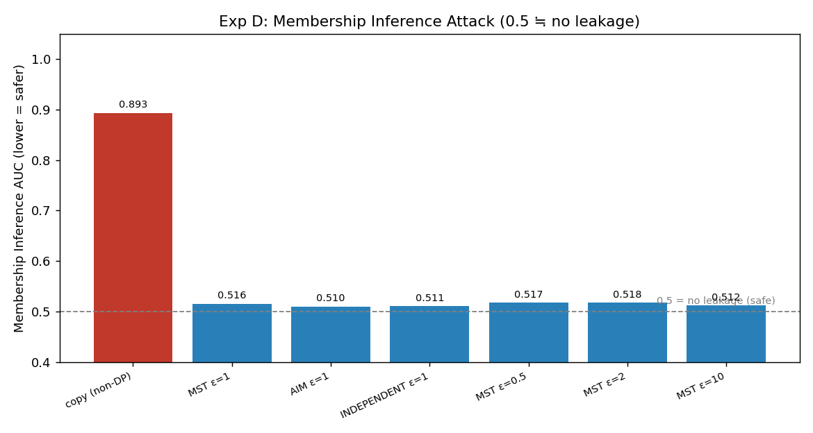

# DPSynth を対象とした差分プライバシー付き合成テーブルデータ生成の実証評価

対象ライブラリ: **[google/dpsynth](https://github.com/google/dpsynth)** — *Differentially Private Synthetic Tabular Data Generation*
作成日: 2026-06-02 ／ 実験環境: WSL2 (Ubuntu 24.04) + Python 3.12 + uv（環境構築の詳細は [環境構築ノート](setup.html) を参照）

---

## 1. アブストラクト

本レポートは、差分プライバシー（DP）付き合成テーブルデータ生成ライブラリ **DPSynth** を対象とした実証評価である。公開データ **UCI Adult Income** を用い、In-Memory API で 3 機構（MST・AIM・INDEPENDENT）を分布再現性・下流タスク性能・経験的プライバシーの観点から比較した。本実験条件では、列間依存を扱う MST／AIM が相関を一定程度保持し、独立仮定の INDEPENDENT より下流タスク性能が高かった。一方、数値列の離散化による再現性低下、単表前提による適用範囲の制約、実装成熟度の課題も確認された。結果は単一データセット・特定バージョンに基づき、一般化には追加検証を要する。

---

## 2. イントロダクション

医療・金融・人事などの分野では、機微な属性を含むテーブルデータを分析・共有・検証に利用したいという実務上の要請が広く存在する。一方で、こうしたデータの共有は個人のプライバシーリスクを伴うため、しばしば困難である。

従来の匿名化・マスキング（特定列の削除や一般化、`k`-匿名化など）は、外部データとの**リンケージ攻撃**（複数のデータセットを突き合わせて個人を再識別する攻撃）に対して脆弱な場合があることが知られている [\[2\]](#ref2)。すなわち、単独のデータセットを加工するだけでは、外部情報との照合による再識別リスクを十分に扱えないことがある。

**差分プライバシー（Differential Privacy, DP）** は、ある 1 個人のレコードを加えても除いても、アルゴリズムの出力分布がほとんど変化しないことを数学的に保証する枠組みである [\[14\]](#ref14)。この保証の強さはプライバシー予算 `(ε, δ)` で制御される。**合成データ（synthetic data）** とは、元データそのものではなく、元データの統計的性質を模した人工的に生成されたデータを指す。**差分プライバシー付き合成データ生成**は、DP を満たしつつ元データの分布・相関を保った合成データを生成することで、上記の課題に対する一つの選択肢を与える。生成された合成データは特定個人の復元が困難であるため、比較的自由に共有・分析できる可能性がある。

本レポートでは、Google が公開している OSS である **DPSynth** を取り上げる。DPSynth は公開されて間もなく、第三者による実証的な評価例がまだ少ない。そこで本レポートは、実データに近い公開データ（UCI Adult Income）を用いて、その有用性・経験的プライバシー・実装上の制約を早期に検証する。本レポートの貢献は以下の三点に整理される。

1. DPSynth の前提（対象データ形式・プライバシー単位）と処理構造を、ドキュメント・ソースコードに基づき整理した（第3章）。
2. UCI Adult Income データを用いて実験を行い、複数の生成機構（MST・AIM・INDEPENDENT）を、分布再現性・下流タスク性能・経験的プライバシーの観点から比較した（第4〜5章）。
3. 結果と前提に基づき、DPSynth の有用性・経験的プライバシー・実装上の制約を整理し、適用範囲（どのデータ形式・用途に適し／適さないか）と実務導入時の留意点を考察した（第6〜7章）。

---

## 3. 関連技術・対象ライブラリの概要

### 3.1 DPSynth の概要

DPSynth は、機微なテーブルデータから、差分プライバシー `(ε, δ)` を保証しつつ、元データの統計的性質（分布・列間相関）を保った合成データを生成する OSS ライブラリである [\[1\]](#ref1)[\[2\]](#ref2)。中核となるのは、**周辺分布（マージナル, marginal）** ——一部の列だけに注目した分布、たとえば 1 列の分布（1-way）や 2 列の同時分布（2-way）——を DP 付きで測定し、それらと整合する同時分布を**グラフィカルモデル**（変数間の依存関係を表す確率モデル）で推定してサンプリングするという手法である [\[5\]](#ref5)[\[10\]](#ref10)。個々のレコードを記憶するのではなく、ノイズを加えた集計統計量のみからモデルを構築するため、DP が成立する。

### 3.2 2 つの実行モデルと本レポートの対象

DPSynth は規模に応じて 2 つの実行系を提供する [\[2\]](#ref2)。

**表1: 2 つの実行モデルの比較**

| | In-Memory DataFrame API | Scalable Pipeline API |
|---|---|---|
| 入出力 | Pandas DataFrame | シャーディングされたファイル / SQL / TFRecord |
| 実行基盤 | 単一マシン RAM (`pipeline_dp.LocalBackend`) | Apache Beam / Spark (`pipeline_dp.BeamBackend`) |
| 想定規模 | 数千〜数百万行 | 大規模クラスタ・超大規模データ |
| 主な用途 | 研究・プロトタイピング | 本番データパイプライン |
| 本レポートの対象 | ✅ **対象**（以降の実験はすべてこちら） | ❌ 対象外（概要紹介のみ） |

**本レポートが評価対象とするのは In-Memory DataFrame API のみ**であり、Apache Beam による分散実行（Scalable Pipeline API）は評価していない。各 API の具体的な呼び出し方・コード例・CLI の利用方法は、本文から分離して [API・CLI 利用ノート](usage.html) に収めている。

### 3.3 対応アルゴリズム（生成機構）

DPSynth は次の生成機構をサポートする [\[3\]](#ref3)。本レポートではこのうち MST・AIM・INDEPENDENT を比較対象とする。

**表2: 対応する生成機構**

| 機構 | 概要 | 特徴 |
|---|---|---|
| **AIM** (Adaptive Iterative Mechanism) | ワークロード（再現を重視するマージナルの集合）・予算・データ特性に基づき、低次元のマージナルを**適応的に選択・測定**する反復型の手法 [\[8\]](#ref8) | 下流タスクに効く相関を優先的に捉えやすい。計算コストは相対的に高い |
| **MST** (Maximum Spanning Tree) | DP の指数機構（候補からスコアに応じて確率的に選ぶ仕組み）で**ペア相関の最大全域木**を選び、2 変量依存を DP でモデル化する [\[9\]](#ref9) | 高速。多くの場合に妥当なベースラインとなる |
| **INDEPENDENT** | 1-way マージナルのみを測定し、全属性を**独立**にモデル化する | 最も単純なベースライン。列間相関は保持されない |
| **SWIFT** | スケーラブルな合成に向けた最適化機構（後述のとおり外部論文は確認できず） | 大規模向け。本レポートでは未評価 |

いずれの機構も、推定エンジンとして **Private-PGM**（[`mbi`](https://github.com/ryan112358/mbi)、測定済みのマージナルと整合する同時分布をグラフィカルモデルとして推定する手法）を共有する [\[10\]](#ref10)。すなわち各機構の違いは「**どのマージナルを、どの予算配分で測定するか**」という戦略の違いとして整理できる。

> 📘 **機構選定に関する注記**: In-Memory API `dpsynth.generate()` の**デフォルト機構は MST** である（`discrete_config` 引数の既定値が `MSTConfig()`）。DPSynth はデータ特性に応じて機構を自動選定する機能を持たないため、**どの機構を採用するかはユーザ自身の責任で判断する必要がある**。選定の考え方は [google/dpsynth 公式ドキュメント](https://github.com/google/dpsynth)に断片的な記載があるのみのため、本サイトでは補足として各機構の解説ページ（[MST](method-mst.html)・[AIM](method-aim.html)・[INDEPENDENT](method-independent.html)）と、本レポートの実験結果に基づく[手法選定ガイド](method-selection.html)を用意した。

### 3.4 ライブラリとしての位置づけ

> 🔎 **考察**（DPSynth には論文が無く、README も公式サポート対象外と明記している。以下はコードとドキュメント構造からの整理であり、推定を含む）。

DPSynth は、新しい DP アルゴリズムを単体で提案したものではなく、**既存の確立した DP 合成手法・グラフィカルモデル推定・DP 予算会計・分散処理基盤を統合したライブラリ**として位置づけられる [\[1\]](#ref1)[\[8\]](#ref8)[\[9\]](#ref9)[\[10\]](#ref10)。



具体的には、AIM・MST のアルゴリズム自体や Private-PGM の参照実装（`mbi`）は既発表であり、DPSynth はこれらを単一マシン専用の実装から `pipeline_dp` 上へ再実装することで分散スケールを可能にし、生データからの離散化・ドメイン発見を含む end-to-end の処理として整備した点に主な工学的貢献があると考えられる。なお SWIFT のみドキュメントに外部論文の引用が無く、本ライブラリ独自の機構である可能性があるが、断定はできない。

### 3.5 対象データの形式とプライバシー単位

DPSynth の前提は、**単一フラット表（single-table schema）であり、かつ各行が独立したプライバシー単位（1 行 = 1 プライバシー単位）であること**である [\[1\]](#ref1)[\[6\]](#ref6)。列はスカラー値のみを対象とし、繰り返し・ネスト構造を持つ列は解析時に無視される [\[6\]](#ref6)。本実験で用いる UCI Adult Income は「1 行 = 1 個人」の単表マスターデータであり、この前提に合致する。

この前提から外れるデータ形式（1 個人が複数行を持つトランザクション、複数テーブル、時系列・グラフ）では、保持される構造そのものが異なるか、または行レベル DP の前提が崩れる。各形式への当てはめは第6章で考察する。属性型（Categorical / OpenSet / Numerical）の定義や処理ライフサイクルの詳細は [API・CLI 利用ノート](usage.html) を参照されたい。

---

## 4. 実験設定と評価方法

> 🔎 本章で示す設定・評価方法は本実験のものであり、DPSynth のドキュメント記載ではない。実行コマンド・依存バージョン・乱数シードの詳細は [再現手順ノート](reproduce.html) に収めている。

### 4.1 実験の問い

本実験は次の問いを扱う。**差分プライバシーという制約の下で、DPSynth は (i) 元データの分布をどの程度再現し、(ii) 下流タスク（合成データの利用先となる分析・予測タスク。本実験では収入予測）にどの程度有用なデータを生成し、(iii) 経験的なプライバシー攻撃に対してどの程度頑健か。また、それらは生成機構の選択やプライバシー予算によってどう変化するか。**

### 4.2 データセット

- **データセット**: UCI Adult Income（"Census Income"、48,842 行）。各行は 1 個人の国勢調査レコードに対応する。
- **サンプリング**: 全体から 20,000 行を抽出して合成元とした（`seed=42`）。
- **対象列（9 列）**: 数値列 `age`, `hours-per-week`／カテゴリ列 `workclass`, `education`, `marital-status`, `occupation`, `race`, `gender`, `income`。
- **目的変数**: `income`（年収が 50K ドルを超えるか否かの二値）。下流タスクの予測対象に用いる。

### 4.3 評価した生成機構と主要パラメータ

- **生成機構**: MST・AIM・INDEPENDENT の 3 種を、共通条件 `ε=1.0, δ=1e-5` で比較した。
- **プライバシー予算 ε を変えた比較（MST）**: 機構を MST に固定し、ε のみを `0.5 / 1.0 / 2.0 / 10.0` の 4 水準に変えて生成する（`δ=1e-5` 固定）。ε とプライバシー・有用性の関係を見るための条件である。
- **数値列のビン数**: `numerical_bins=16`（数値列は等頻度の分位ビンに離散化される）。ビン数の感度は別途 [追加実験](experiments.html) で扱う。
- **乱数シード・試行回数**: 第5章の主表は単一シード（`seed=42`）での代表的な 1 実行である。シードを変えたときのばらつきは別途 [追加実験](experiments.html)（実験B）で複数シードの平均±標準偏差として定量化している。

### 4.4 評価指標

本実験では、前掲の問い (i)〜(iii) に対応して、表3 の指標を用いる。略語は初出のため表の下で簡潔に定義する。

**表3: 評価観点と指標**

| 評価観点（問い） | 指標 | 測る対象 | 良い方向 |
|---|---|---|---|
| (i) 周辺分布の再現性 | 1-way TVD | 各列の実データ分布と合成分布の差 | 小（0 に近い） |
| (ii) 列間相関の保持 | 相関誤差（数値ペア）／2-way TVD | 数値ペアの Pearson 相関の絶対誤差、属性ペア同時分布の差 | 小 |
| (ii) 下流タスク性能 | TSTR ROC-AUC ほか | 合成データで学習した分類器の実データ上の予測性能 | 大 |
| (iii) 経験的プライバシー | MIA ROC-AUC | メンバーシップ推定の成否 | 0.5 付近（漏洩なし） |

- **TVD（Total Variation Distance, 全変動距離）**: 二つの分布の差を 0〜1 で表す尺度で、0 のとき完全一致。
- **TSTR（Train on Synthetic, Test on Real）**: 合成データで予測モデルを学習し、実データで評価する方式。本実験では `income>50K` の二値分類器（勾配ブースティング）を学習し、合成元に**含まれない**実データ 8,000 行で評価する。参照値として、実データで学習・実データで評価する **TRTR（Train on Real, Test on Real）** を併記する（理論的な上界ではなく、本実験での到達目標を示す経験的な**参照上限**）。
- **MIA（Membership Inference Attack, メンバーシップ推論攻撃）**: あるレコードが学習（合成元）に含まれていたか否かを推定する攻撃 [\[15\]](#ref15)。本実験では、各レコードの合成データへの最近傍距離を手がかりにメンバー／非メンバーを判別する距離ベースの MIA を用い、**ROC-AUC** で測る。AUC ≈ 0.5 は漏洩なしを意味する。
- 属性ペアの同時分布（2-way）の忠実度は [追加実験](experiments.html)（実験C）で別途評価する。

### 4.5 評価の限界

本実験の結果を解釈するうえで、以下の限界に留意する必要がある。

- 評価は**単一のデータセット**（UCI Adult Income）に基づく。データの分布特性が異なれば、機構間の優劣やパラメータの最適値は変わりうる。
- UCI Adult Income は**公開データ**であり、実際の機微データとは分布・カーディナリティ・列構成が異なる。本実験の知見をそのまま実務データへ一般化することはできない。
- MIA は**経験的な評価**であり、しかも本実験で用いたのは比較的弱い距離ベースの攻撃である。これは差分プライバシーの数学的保証 `(ε, δ)` を代替するものではなく、一種類の経験的チェックに過ぎない。より強い攻撃（シャドウモデル型 MIA など）は未実施である。

---

## 5. 実験結果

> 🔎 本章の数値は本実験の一次情報（`outputs/metrics.json`・`experiments/` 由来）であり、ドキュメント記載ではない。結果の解釈は第6章に分離する。

### 5.1 機構比較とプライバシー予算 ε の影響

下表は、機構比較（`ε=1.0`）と、MST について ε を 4 水準に変えた比較の結果をまとめたものである。各列は左から、平均 1-way TVD（小さいほど分布が一致）、相関誤差（小さいほど数値相関を保持）、TSTR の AUC・正解率・F1（大きいほど下流タスクに有用）、生成時間である。最下行の TRTR は実データ学習による参照上限（経験的な参照値）を示す。

**表4: 機構比較（ε=1.0）と MST のプライバシー予算 ε を変えた比較**

| 設定 | 平均 1-way TVD ↓ | 相関誤差 ↓ | TSTR AUC ↑ | TSTR 正解率 | TSTR F1 | 生成時間 |
|---|---|---|---|---|---|---|
| **MST** (ε=1.0) | 0.098 | **0.064** | 0.687 | 0.723 | 0.427 | 約 10 秒 |
| **AIM** (ε=1.0) | **0.105** | 0.226 | **0.768** | 0.754 | 0.505 | 約 90 秒 |
| **INDEPENDENT** (ε=1.0) | 0.106 | 0.077 | 0.433 | 0.759 | 0.003 | 約 6 秒 |
| MST (ε=0.5) | 0.120 | 0.084 | 0.655 | 0.721 | 0.460 | 約 10 秒 |
| MST (ε=2.0) | 0.110 | 0.069 | 0.642 | 0.734 | 0.403 | 約 7 秒 |
| MST (ε=10.0) | **0.059** | 0.070 | 0.681 | 0.745 | 0.402 | 約 9 秒 |
| *TRTR 参照上限(実データ学習)* | *—* | *—* | *0.893* | *0.841* | *0.625* | *—* |

太字は各指標の最良値を示す。本表は単一シード（`seed=42`）・特定の依存バージョンでの代表的な 1 実行の結果であり、個々の数値は環境やシードにより前後する。機構間の定性的な順序関係（下流タスク性能 AIM > MST > INDEPENDENT）は、別環境・複数シードでも再現することを確認している（[追加実験](experiments.html) 実験B）。

本表から、本実験条件において以下の点が**事実として**読み取れる。

- 平均 1-way TVD は 3 機構でほぼ同程度（0.098〜0.106）であり、この指標だけでは機構間の差はほとんど判別できない。
- TSTR AUC は AIM（0.768）> MST（0.687）> INDEPENDENT（0.433）の順で、INDEPENDENT のみ大きく劣る。INDEPENDENT は TSTR F1 が約 0 であり、ほぼ全件を `<=50K` と予測している。
- MST の平均 1-way TVD は ε の増加に伴っておおむね改善する（ε=0.5: 0.120 → ε=1.0: 0.098 → ε=10.0: 0.059）。ε=2.0 でわずかに悪化しているのは単一シードの確率的ばらつきによる。

### 5.2 列ごとの分布再現性

**図1: 機構別の列ごと 1-way TVD（ε=1.0）** — 横軸が各列、縦軸が TVD（小さいほど一致）。カテゴリ列はいずれの機構でも低誤差である一方、数値列（`age`, `hours-per-week`）の TVD が支配的に大きいことを示す。これは第6章で述べる「数値列が誤差の主因」という解釈を支持する。



**図2: プライバシー–有用性トレードオフ（MST）** — 横軸が ε、縦軸が平均 1-way TVD。ε を大きくする（プライバシーを緩める）ほど平均 TVD がおおむね低下する傾向を示す。ε=2.0 の非単調性は単一シードのばらつきによる。



**図3: 分布再現の例（`education`, ε=1.0）** — `education` 列の実データ分布と各機構の合成分布を重ねて示す。カテゴリ列では各機構の分布が実データとほぼ重なり、再現性が高いことを可視化したものである。



### 5.3 下流タスク性能

**図4: 下流タスク性能（TSTR AUC）** — 各機構の TSTR AUC を棒で、TRTR（参照上限）を参照線で示す。列間相関を保持する MST／AIM が INDEPENDENT を上回り、AIM が TRTR に最も接近していることを示す。これは 5.1 の表の TSTR AUC 列を可視化したものである。



### 5.4 経験的プライバシー（MIA）

距離ベースの MIA による経験的プライバシー評価の結果を示す。スコアは ROC-AUC（0.5 ≒ 漏洩なし）である。対照として、非 DP のコピー（合成データ＝合成元そのもの）を置いた。

**表5: 距離ベース MIA の結果（ROC-AUC）**

| 合成データ | MIA AUC（0.5 ≒ 漏洩なし） |
|---|---|
| **copy（非DP・対照）** | **0.893** |
| MST ε=1 | 0.516 |
| AIM ε=1 | 0.510 |
| INDEPENDENT ε=1 | 0.511 |
| MST ε=0.5 | 0.518 |
| MST ε=2 | 0.518 |
| MST ε=10 | 0.512 |

**図5: メンバーシップ推論攻撃（MIA）の AUC** — 縦軸が MIA AUC。非 DP のコピーは AUC ≈ 0.89 で明確に判別可能である一方、DP 合成データはいずれも AUC ≈ 0.51 で 0.5 付近に張り付くことを示す。これは「マージナルからのみ生成する DP 合成では、本攻撃でメンバーシップの手がかりがほぼ得られない」ことを示す。



本実験条件において、以下の点が事実として読み取れる。

- 非 DP のコピーは AUC 0.893 であり、攻撃自体は機能している。
- DP 合成データは機構・ε によらず AUC ≈ 0.51 であり、本攻撃ではメンバーシップの手がかりがほぼ検出されなかった。
- ε による AUC の差はほとんど見られない（0.51〜0.52）。

なお、より深掘りした追加実験（数値ビン数の感度、複数シード頑健性、2-way 周辺分布の忠実度、MIA の詳細）は [追加実験ページ](experiments.html) に分けて収録している。

---

## 6. 考察

> 🔎 **考察**（本章は全体が、第5章の結果に対する筆者の解釈・推定である）。

### 6.1 機構間の差が生じた理由

本実験条件では、MST／AIM が INDEPENDENT より下流タスク性能で優位だった。この差は、平均 1-way TVD ではほとんど現れない一方、TSTR AUC で明確に現れた（第5.1節）。INDEPENDENT は 1-way（各列単独）の分布は良好に再現するが、全属性を独立と仮定するため、特徴量と目的変数 `income` の間の依存関係を一切保持しない。一方 MST はペア相関の最大全域木を、AIM はワークロードに応じたマージナルを保持する。この差が、相関の有無に敏感な下流予測タスクで顕在化したと解釈できる。すなわち「1-way 分布の一致は、必ずしも下流タスクにおける有用性を意味しない」「列間依存のモデル化が下流タスクの有用性に寄与する」ことが、本実験条件において示唆される。

AIM が MST をやや上回った点は、AIM がワークロードに応じて有用なマージナルを適応的に選択するため、より広いペア相関を保持できることに整合する。ただし AIM は計算コストが高く（本実験で約 90 秒、MST の約 10 倍）、ラウンド数などのパラメータ依存性も大きい。MST と AIM の優劣はシード次第で逆転しうる程度の差であり（[追加実験](experiments.html) 実験B）、一般論として AIM が常に優れると断定はできない。

数値列が分布再現性の主たる誤差源であった点（図1）は、連続値が等頻度の分位ビンに離散化される処理に由来すると考えられる。特に一点に集中する分布（本データの `hours-per-week`）はビン化の影響を受けやすい。ビン数の選択には最適値が存在しうることを [追加実験](experiments.html)（実験A）で確認している。

### 6.2 適用範囲：前提から導かれる適否と、本実験が裏づける有用性

DPSynth が適する／適さないデータ形式は、その**前提**（第3.5節：単一フラット表・1 行 = 1 プライバシー単位）からおおむね導かれ、本実験を要しない。本実験が新たに与えるのは、**前提に合致する単表マスターの場合に、列間相関の保持が下流タスクの有用性にどの程度寄与するか**という定量的な裏づけ（第6.1節）である。表6 に、各用途の適性と、その判断が前提由来か本実験由来かを整理する。

**表6: データ形式・用途ごとの適性と根拠**

| 用途・データ形式 | 適性 | 根拠（前提／本実験の区別） |
|---|---|---|
| 単表マスター（1 行 = 1 エンティティ。本実験の Adult が該当） | 高い | 前提に合致。さらに**本実験**が相関保持→下流有用性を定量確認（§6.1） |
| プロトタイピング・分析コードの事前検証 | 見込める | 前提に合致。**本実験**の有用性水準（TSTR）が達成可能性の目安 |
| データ構造・分布感の共有 | 見込める | 前提に合致。スキーマ・統計量を保持（前提から導かれる） |
| トランザクション（1 人 = 多数行） | 限定的 | 前提から逸脱。系列・件数は非保持、行レベル DP で個人単位の保証が弱まる |
| 複数テーブル（外部キー） | 不可 | 前提（単表）外。参照整合性・表間相関は対象外（リレーショナル合成器の領域） |
| 時系列・グラフ | 不可 | 前提外。順序・自己相関・ネットワーク構造は対象外 |
| 厳密な個票再現が必要な用途 | 不適 | DP 合成は集計統計量からの生成で、個票の忠実再現を目的としない |

要するに、**「自分のデータが表6 のどれに当たるか」は前提から判定でき**、本実験の固有の貢献は、その中で「前提に合致するケースの有用性の程度」を定量的に示した点にある。

### 6.3 差分プライバシーの保証と経験的攻撃評価の関係

第5.4節で、DP 合成データは本実験の距離ベース MIA に対して頑健であった（AUC ≈ 0.51）。これは DP の理論的保証と整合する経験的観察である。ただし、ε による AUC の差がほとんど見られなかったことには注意を要する。これは ε ごとの安全性が同等であることを意味するのではなく、本実験で用いた攻撃が比較的弱く、これらの ε ではすでに漏洩信号が下限（0.5）付近に達しているため、攻撃側で差を検出できなかったと解釈するのが妥当である。ε に依存する安全性の差を精査するには、より強い攻撃（シャドウモデル型など）が必要と考えられる。

重要なのは、経験的な攻撃評価は DP の数学的保証を**確認・補完**するものであって、**代替**するものではないという点である。攻撃で漏洩が検出されないことは安全性の必要条件を示すに過ぎず、最終的な保証の根拠は `(ε, δ)` という設計上のパラメータにある。

### 6.4 実務導入時の留意点

以上を踏まえると、DPSynth の実務導入は「生成できるか」だけでなく、次の 4 つの設計軸を一体で評価・設計することが望ましい。表7 に、各軸が本実験のどの結果に対応し、第7章のどの残課題につながるかを示す（この対応は §7 の各表と相互参照する）。

**表7: 導入時の 4 つの設計軸と本レポートでの対応**

| 設計軸 | 内容 | 本実験での対応 | 深掘りすべき残課題 |
|---|---|---|---|
| 有用性評価 | 対象タスクに即した指標で有用性を検証 | TSTR（§5.3） | 複数データセット・実業務データ評価、ε/ビン数感度（§7.1） |
| 安全性評価 | 想定脅威に応じた経験的プライバシー評価 | 距離型 MIA（§5.4、弱い攻撃に留まる） | MIA 以外・より強い攻撃（§7.1） |
| プライバシー予算設計 | ε, δ の決定とトレードオフの把握 | ε を変えた比較（§5.1） | ε 感度分析（§7.1） |
| 公開範囲・運用 | 配布先に応じたリスク受容と運用体制 | （本実験の対象外） | 実装成熟度・大規模検証・分散 API（§7.2） |

---

## 7. 残課題

残課題を研究上の課題と実装・運用上の課題に分け、それぞれが第6.4節のどの設計軸・本文のどの限界に対応するかを併記する（第6.4節の表7 と相互参照する）。

### 7.1 研究上の残課題

**表8: 研究上の残課題と対応**

| 残課題 | 動機（本文の対応箇所） | 対応する設計軸（§6.4） |
|---|---|---|
| 複数データセットでの評価 | §4.5 単一データセットの限界 | 有用性評価 |
| ε・ビン数に対する感度分析 | §5.1・[追加実験](experiments.html) 実験A | 有用性評価／予算設計 |
| 実業務データに近いデータでの評価 | §4.5 公開データの限界 | 有用性・安全性評価 |
| MIA 以外・より強い攻撃評価 | §4.5・§6.3 距離型 MIA の弱さ | 安全性評価 |
| 単表以外（複数テーブル・時系列）への拡張可能性 | §3.5・§6.2 適用範囲 | 利用目的・データ形式 |

### 7.2 実装・運用上の残課題

いずれも「公開範囲・運用」軸（§6.4）に関わるエンジニアリング上の課題で、詳細は [実装ノート](engineering-notes.html) および [環境構築ノート](setup.html) に分離して記載している。

**表9: 実装・運用上の残課題と対応**

| 残課題 | 内容 | 対応する設計軸（§6.4） |
|---|---|---|
| 環境構築の容易性 | `python-dp` の Windows ホイール非対応などプラットフォーム制約 | 公開範囲・運用 |
| ライブラリの成熟度 | 研究段階・非公式サポートに由来する実装の粗さ（パッケージング漏れ、機構間の非互換など） | 公開範囲・運用 |
| エラー時の切り分け | 小さい ε での会計破綻など、例外発生時の原因特定 | 公開範囲・運用 |
| 大規模データでの検証 | 本実験は 20,000 行規模であり、より大規模な入力での挙動は未検証 | 公開範囲・運用／予算設計 |
| Scalable Pipeline API の評価 | Apache Beam バックエンドでの分散生成は未評価 | 公開範囲・運用 |

---

## 8. 結論

本レポートでは、差分プライバシー付き合成テーブルデータ生成ライブラリ DPSynth を対象に、UCI Adult Income データを用いて、分布再現性・下流タスク性能・経験的プライバシーの観点から実証評価を行った。主な結論は以下のとおりである。

- DPSynth は、差分プライバシー付きの合成テーブルデータ生成を実験・検証するうえで有用な OSS である。
- 本実験条件では、列間依存を扱う MST／AIM が、各属性を独立に扱う INDEPENDENT より下流タスク性能の面で優位だった。この差は 1-way 分布の再現性ではなく、下流タスク性能において顕在化した。
- 一方で、数値列の離散化に伴う分布再現性の低下、単一フラット表を前提とする適用範囲の制約、研究段階に由来する実装成熟度の課題があり、これらを理解したうえで利用する必要がある。
- 実務利用にあたっては、「生成できるか」だけでなく、「どの利用目的に対して、どの程度の有用性と安全性を満たすか」を、有用性評価・安全性評価・利用目的・公開範囲をセットにして評価する必要がある。

これらの知見は単一データセット・特定の依存バージョン・特定の攻撃設定に基づくものであり、一般化には第7章で挙げた追加検証を要する。

---

## 9. 再現方法に関する補足

本レポートの実験は、公開リポジトリのコードとコマンドで再現できる。詳細な環境構築手順・実行コマンド・スクリプトの説明は本文に含めず、以下の別ページに集約している。

- **環境構築・依存関係**: [環境構築ノート（setup.html）](setup.html)
- **API・CLI の利用方法**: [API・CLI 利用ノート（usage.html）](usage.html)
- **実験再現手順**: [再現手順ノート（reproduce.html）](reproduce.html)
- **実装上の問題と対応**: [実装ノート（engineering-notes.html）](engineering-notes.html)
- **追加実験**: [追加実験ページ（experiments.html）](experiments.html)

再現に必要な主要情報の要点は以下のとおりである。

- **主要バージョン**: Python 3.12.3、WSL2 (Ubuntu 24.04)。全依存は [`requirements.txt`](requirements.txt) でバージョン固定（`jax` / `mbi` / `numpy` 等の差による乱数列の揺れを抑制。`mbi` はコミットハッシュまで固定）。
- **乱数シード**: 合成元サンプリングおよび生成は `seed=42`（主表）。複数シードでのばらつきは [追加実験](experiments.html) 実験Bを参照。
- **入力データ**: UCI Adult Income（48,842 行）。`scripts/00_prepare_data.py` が取得・整形する。
- **出力ファイルの場所**: 合成 CSV と指標は `outputs/`（`metrics.json`, `run_meta.json`）、評価図は `figures/`、レポート HTML は `htmls/` に生成される。

実行の最短手順（Linux / WSL2 環境）は次のとおりであり、各ステップの詳細は上記の別ページに記載している。

```bash
git clone https://github.com/gghatano/dpsynth-demo.git
cd dpsynth-demo
bash scripts/setup_env.sh   # 環境構築（詳細は setup.html）
bash scripts/run_all.sh     # データ取得→生成→評価→HTML 生成（詳細は reproduce.html）
```

---

## 10. 参考文献

本文中の出典タグ **[n]** は以下を指す。`docs/` は [google/dpsynth/dpsynth/documentation/](https://github.com/google/dpsynth/tree/main/dpsynth/documentation) を表す。upstream ドキュメントには行アンカーが無いため、ページ内の位置はセクション見出し名で示す。

### 主要文献・リンク

- リポジトリ（対象ライブラリ）: https://github.com/google/dpsynth
- Private-PGM (`mbi`): https://github.com/ryan112358/mbi
- pipeline_dp: https://github.com/google/pipeline-dp
- AIM: McKenna et al., *AIM: An Adaptive and Iterative Mechanism for Differentially Private Synthetic Data* — [arXiv:2201.12677](https://arxiv.org/abs/2201.12677)
- MST: McKenna et al., *Winning the NIST Contest: A scalable and general approach to differentially private synthetic data* — [arXiv:2108.04978](https://arxiv.org/abs/2108.04978)
- Private-PGM（基礎）: McKenna, Sheldon, Miklau, *Graphical-model based estimation and inference for differential privacy*, ICML 2019 — [arXiv:1901.09136](https://arxiv.org/abs/1901.09136)
- 差分プライバシーの基礎: Dwork & Roth, *The Algorithmic Foundations of Differential Privacy*, 2014 — [PDF](https://www.cis.upenn.edu/~aaroth/Papers/privacybook.pdf)
- メンバーシップ推論攻撃: Shokri et al., *Membership Inference Attacks Against Machine Learning Models*, IEEE S&P 2017 — [arXiv:1610.05820](https://arxiv.org/abs/1610.05820)
- UCI Adult / Census Income データセット: [UCI Machine Learning Repository](https://archive.ics.uci.edu/dataset/2/adult)

### 出典タグ対応表

<a id="ref1"></a>**[1]** dpsynth **README**（リポジトリ直下）— "Core Concepts & Synthesis Lifecycle" / "Project Structure & Modules"。[README.md](https://github.com/google/dpsynth/blob/main/README.md)

<a id="ref2"></a>**[2]** **docs/index.md** — "Why DPSynth?"（匿名化の限界・DP の動機）/ "Core APIs and Execution Models"（In-Memory と Beam の 2 実行系）。[index.md](https://github.com/google/dpsynth/blob/main/dpsynth/documentation/index.md)

<a id="ref3"></a>**[3]** **docs/index.md** — "Supported Synthesis Algorithms"（AIM / MST / SWIFT / INDEPENDENT）。[index.md](https://github.com/google/dpsynth/blob/main/dpsynth/documentation/index.md)

<a id="ref4"></a>**[4]** **docs/in_memory_api.md** — "Function Signature"（`dpsynth.generate` の引数・既定値）。[in_memory_api.md](https://github.com/google/dpsynth/blob/main/dpsynth/documentation/in_memory_api.md)

<a id="ref5"></a>**[5]** **docs/in_memory_api.md** — "Under the Hood: The In-Memory Lifecycle"（離散化→符号化→圧縮→機構→復号の 5 段階）。/ [docs/processing_lifecycle.md](https://github.com/google/dpsynth/blob/main/dpsynth/documentation/processing_lifecycle.md)

<a id="ref6"></a>**[6]** **docs/data_and_terminology.md** — "Supported Attribute Classifications"（Categorical/OpenSet/Numerical）/ "Writing a domain.yaml"。[data_and_terminology.md](https://github.com/google/dpsynth/blob/main/dpsynth/documentation/data_and_terminology.md)

<a id="ref7"></a>**[7]** **docs/scalable_beam_api.md**（Scalable Pipeline / Beam API）/ [examples/quickstart.ipynb](https://github.com/google/dpsynth/blob/main/dpsynth/examples/quickstart.ipynb)。[scalable_beam_api.md](https://github.com/google/dpsynth/blob/main/dpsynth/documentation/scalable_beam_api.md)

<a id="ref8"></a>**[8]** **AIM** — McKenna et al., *AIM: An Adaptive and Iterative Mechanism for DP Synthetic Data*。[arXiv:2201.12677](https://arxiv.org/abs/2201.12677)

<a id="ref9"></a>**[9]** **MST** — McKenna et al., *Winning the NIST Contest*。[arXiv:2108.04978](https://arxiv.org/abs/2108.04978)

<a id="ref10"></a>**[10]** **Private-PGM / `mbi`** — McKenna, Sheldon, Miklau, *Graphical-model based estimation and inference for DP*, ICML 2019。[arXiv:1901.09136](https://arxiv.org/abs/1901.09136) / [mbi](https://github.com/ryan112358/mbi)

<a id="ref11"></a>**[11]** dpsynth ソース [`data_generation_v2.py`](https://github.com/google/dpsynth/blob/main/dpsynth/data_generation_v2.py)（1-way マージナル測定→ドメイン圧縮→機構実行→復号の実装）

<a id="ref12"></a>**[12]** dpsynth ソース [`discrete_mechanisms/independent.py`](https://github.com/google/dpsynth/blob/main/dpsynth/discrete_mechanisms/independent.py)（INDEPENDENT 機構。`expand` への重複クリーク）

<a id="ref13"></a>**[13]** dpsynth **README** 末尾 — "This is not an officially supported Google product"（非公式・サポート外）。[README.md](https://github.com/google/dpsynth/blob/main/README.md)

<a id="ref14"></a>**[14]** 差分プライバシーの基礎 — Dwork & Roth, *The Algorithmic Foundations of Differential Privacy*, 2014（DP の定義・`(ε, δ)` の意味）。[PDF](https://www.cis.upenn.edu/~aaroth/Papers/privacybook.pdf)

<a id="ref15"></a>**[15]** メンバーシップ推論攻撃の基礎 — Shokri et al., *Membership Inference Attacks Against Machine Learning Models*, IEEE S&P 2017。[arXiv:1610.05820](https://arxiv.org/abs/1610.05820)

> 第5〜7章の数値・不具合は upstream 文書ではなく、本実験の実行で得た一次情報（🔎 考察）である。
