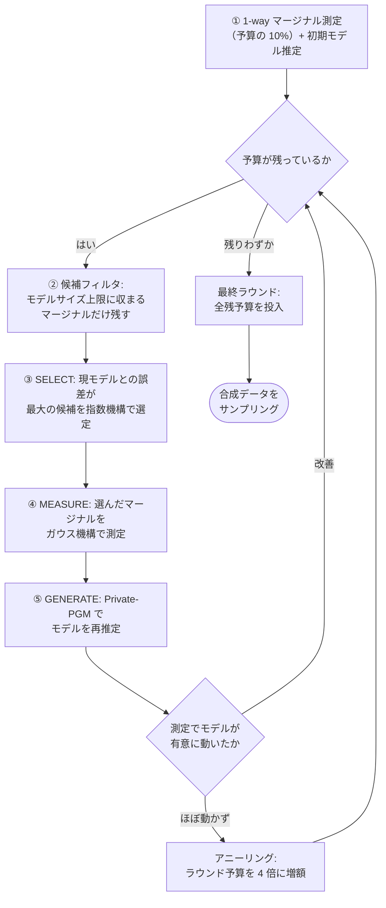

# AIM 機構の解説（Adaptive and Iterative Mechanism）

[手法選定ガイド](method-selection.html) ｜ [MST の解説](method-mst.html) ｜ [INDEPENDENT の解説](method-independent.html) ｜ [メインレポート](index.html)

> 📘 本ページのアルゴリズム・実装の記述は、原論文 [arXiv:2201.12677](https://arxiv.org/abs/2201.12677) と
> [google/dpsynth](https://github.com/google/dpsynth) のソースコード（`dpsynth/discrete_mechanisms/aim.py`、2026-06 時点の main ブランチ）に基づく。
> 実験数値の節（🔎）のみ本デモの実測である。

---

## 1. 位置づけ

**AIM（Adaptive and Iterative Mechanism）**は、SELECT-MEASURE-GENERATE パラダイムの代表的な反復型アルゴリズムである
[arXiv:2201.12677](https://arxiv.org/abs/2201.12677)。
**ワークロード**（合成データで再現を重視するマージナルの集合と重み）を入力として受け取り、
「現在のモデルが最も外しているマージナル」を毎ラウンド適応的に選んで測定し、モデルを少しずつ改善する。

注意: AIM の名前にある「適応的な選択」は**機構内部でどのマージナルを測るかの選択**であり、
「AIM か MST かをデータに応じて選んでくれる」機能ではない（→ [手法選定ガイド](method-selection.html)）。

## 2. アルゴリズムの仕組み

1. **候補の生成**: ワークロード（未指定なら**全属性の 3-way 組み合わせ**）の下方閉包
   （1-way・2-way・3-way のすべての部分集合）が候補になる。各候補の重みは
   「ワークロードとの属性の重なり × ワークロード重み」の合計で、関係が深いマージナルほど選ばれやすい。
2. **候補フィルタ**: 候補を採用した場合のグラフィカルモデルの推定サイズ（junction tree のメモリ量）が
   上限以下のものだけ残す。上限は `max_model_size ×（消費済み予算の割合）`で、
   **予算を使うほど大きなマージナルが解禁される**設計になっている。
3. **SELECT（指数機構）**: 各候補のスコアを
   `重み ×（現モデルとの L1 誤差 − ノイズバイアス補正項）` で評価し、指数機構で 1 つ選ぶ。
   補正項は「測定したときに乗るガウスノイズの期待量」で、
   *誤差は大きいが測ってもノイズに埋もれるだけの巨大なマージナル*が選ばれにくくなる。
4. **MEASURE / GENERATE**: 選んだマージナルをガウス機構で測定し、
   全測定値と整合するモデルを Private-PGM（mirror descent、ウォームスタート）で再推定する。
5. **アニーリング**: 測定してもモデルがほぼ動かなかった場合、「このノイズ水準ではもう情報が取れない」
   と判断してラウンドあたり予算を `anneal_factor`（既定 4）倍に増やし、回数より 1 回の精度を優先する。

## 3. プライバシー予算の使われ方

| ステップ | 予算配分（既定） | 機構 |
|---|---|---|
| 1-way マージナル測定（初期化） | ρ × 10%（`one_way_budget_fraction`） | ガウス機構 |
| 各ラウンドの SELECT | ラウンド予算 × 10%（`select_budget_fraction`） | 指数機構 |
| 各ラウンドの MEASURE | ラウンド予算 × 90% | ガウス機構 |

ラウンド予算は `総予算 ÷ max_rounds`（既定は 16 × 列数 ラウンド）から始まり、アニーリングで増額されうる。
残予算が少なくなると最終ラウンドで全額を投入して終了する。

## 4. 主なパラメータ（`AIMConfig`）

| パラメータ | 既定値 | 意味 |
|---|---|---|
| `workload` | None（全 3-way 組合せ） | 再現を重視するマージナルの集合と重み。**AIM だけが持つ「意図を伝える」口** |
| `max_rounds` | None（16 × 列数） | 最大ラウンド数 |
| `max_model_size` | 80 (MB) | グラフィカルモデルのサイズ上限。**実行時間と精度のトレードオフを司る最重要パラメータ** |
| `max_marginal_size` | 1e6 | 候補に含めるマージナルのセル数上限 |
| `pgm_iters` | 1000 | mirror descent の反復回数 |
| `anneal_factor` | 4.0 | アニーリング時の予算増額倍率 |

> 📘 公式の docstring は「お試しなら `max_model_size=1`、本番用途なら `max_model_size>=80` を推奨。
> 実行に**数時間**かかりうる」と注記している。本デモでは `max_rounds=16, pgm_iters=1000, max_model_size=100`
> に抑えて約 90 秒で実行した。

## 5. 得意なケース・苦手なケース

**得意**:

- **重視するマージナル（相関）が事前に分かっている場合**。ワークロードとして重み付きで指定でき、
  その近傍のマージナルが優先測定される。下流タスク（予測・クロス集計）が明確なときに有利。
- 幅広いペア相関の保持。MST と違い「木」の制約がなく、同じ属性の周りに複数の依存を張れ、3-way も扱える。
- 予算・データ特性に応じて測定の粒度を自動調整したい場合（アニーリング・サイズ上限の仕組み）。

**苦手**:

- **計算コスト**。反復のたびに Private-PGM の再推定が走るため、MST の数倍〜数十倍遅い
  （公式注記では数時間かかりうる）。
- パラメータ依存性。`max_rounds`・`max_model_size` の設定で結果と実行時間が大きく変わる。
- 本デモでは**数値列同士の相関誤差が MST より大きかった**（下記）。設定（ラウンド数・モデルサイズの制限）の
  影響と考えられ、AIM が常に全指標で優るわけではない。

## 6. 本デモでの実験結果

> 🔎 以下は本デモ（UCI Adult、20,000 行、9 列、δ=1e-5）の実測。詳細は各リンク先を参照。

- **機構比較（ε=1.0、[メインレポート §5.1](index.html)）**: TSTR AUC **0.768**（3 機構中最高、実データ学習の
  参照上限に最接近）。一方、数値列の相関誤差は 0.226 と MST（0.064）より大きい。生成時間**約 90 秒**（MST の約 10 倍）。
- **複数シード（[追加実験B](experiments.html)）**: TSTR AUC 0.666 ± 0.153（5 シード）。
  MST（0.670 ± 0.087）と**ほぼ同等**に縮まり、単一シードの優位は確率的ばらつきの範囲だった。
- **2-way 忠実度（[追加実験C](experiments.html)）**: **全属性ペアで最良**（TVD 0.03〜0.15）。
  `marital-status×income` は MST 0.364 に対し AIM 0.034 と 10 倍良い。
  「どのペア相関が重要か決まっているなら AIM」という使い分けの根拠。

## 7. 参考リンク

- 原論文: McKenna et al., *AIM: An Adaptive and Iterative Mechanism for Differentially Private Synthetic Data* — [arXiv:2201.12677](https://arxiv.org/abs/2201.12677)
- 実装: [`dpsynth/discrete_mechanisms/aim.py`](https://github.com/google/dpsynth/blob/main/dpsynth/discrete_mechanisms/aim.py)（GDP 会計版の `aim_gdp.py` もある）
- 公式ドキュメント: [google/dpsynth README「Supported Synthesis Algorithms」](https://github.com/google/dpsynth)
- 推定エンジン: [Private-PGM / `mbi`](https://github.com/ryan112358/mbi)

---

← [手法選定ガイドに戻る](method-selection.html)
