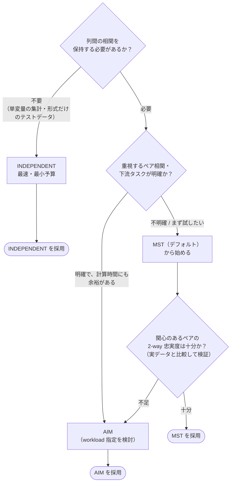

# 手法選定ガイド: MST / AIM / INDEPENDENT をどう選ぶか

各機構の詳細: [MST](method-mst.html) ｜ [AIM](method-aim.html) ｜ [INDEPENDENT](method-independent.html) ｜ [Private-PGM（共有推定エンジン）](method-pgm.html) ｜ [メインレポート](index.html)

> ⚠️ **免責**: DPSynth は機構を自動選定しない。**どの機構を採用するか、またプライバシー予算
> （ε, δ）が要件を満たすかの最終判断は、利用者自身の責任**である。本ページは
> [google/dpsynth 公式ドキュメント](https://github.com/google/dpsynth)の記述と本デモの実験結果に基づく
> **参考情報**であり、結果は単一データセット（UCI Adult）・特定バージョンでの実測に基づく点に注意されたい。

---

## 1. 大前提: ライブラリは選んでくれない

まず押さえるべき事実が 3 つある。

1. **DPSynth に機構の自動選定機能はない**。In-Memory API `dpsynth.generate()` は
   `discrete_config` 引数に渡された設定（`MSTConfig` / `AIMConfig` / `IndependentConfig`）の型を見て
   実行する機構を決めるだけで、データ特性・予算・列数に応じた分岐は実装されていない。
2. **デフォルトは MST**（`discrete_config=MSTConfig()`）。何も指定しなければ MST が動くが、
   これは「MST が最適と判断された」のではなく、単なる引数の既定値である。
3. **公式ドキュメントに体系的な選定ガイドはない**。あるのは断片的な記述
   （INDEPENDENT は "baseline"、AIM は "time consuming (hours)"、SWIFT は高次元データで AIM を改善、など）のみで、
   「データと目的に応じてベンチマークして選ぶ」のが前提の設計になっている。

本ページは、この公式ドキュメントの隙間を本デモの実験結果で補う実践ガイドである。

## 2. 選定フローチャート

要点は次の 3 行に要約できる。

- **迷ったらまず MST（デフォルト）**で生成し、関心のある集計・タスクで品質を検証する。
- **保持したいペア相関・下流タスクが明確で、計算時間に余裕がある → AIM**（ワークロード指定も検討）。
- **周辺分布だけで十分・速度優先・比較基準が欲しい → INDEPENDENT**。

## 3. 観点別の比較表

> 📑 実験値は本デモ（UCI Adult 20,000 行・9 列・ε=1.0・δ=1e-5）の実測。
> 「±」付きは複数シード（[追加実験B](experiments.html)）、単一値は単一シード（[メインレポート §5.1](index.html)）。

| 観点 | [MST](method-mst.html) | [AIM](method-aim.html) | [INDEPENDENT](method-independent.html) |
|---|---|---|---|
| モデル化する依存関係 | 2-way（最大全域木の d−1 ペアのみ） | 1〜3-way を適応選択（木の制約なし） | なし（全列独立） |
| ワークロード（重視マージナル）指定 | 不可 | **可**（`AIMConfig.workload`） | 不可 |
| 生成時間（本デモ） | 約 10 秒 | 約 70 秒（ε=1。高 ε で約 420 秒、公式注記では数時間もありうる） | **約 6 秒** |
| 平均 1-way TVD（複数シード）↓ | **0.084 ± 0.022** | 0.099 ± 0.022 | 0.091 ± 0.017 |
| 下流タスク TSTR AUC（複数シード）↑ | 0.651 ± 0.106 | **0.709 ± 0.051** | 0.506 ± 0.065 |
| 2-way 忠実度（実験C）↓ | ペア依存（0.02〜0.36） | **4 ペア中 3 ペア最良（0.03〜0.16）** | 中位（0.13〜0.22） |
| 主なチューニング項目 | ほぼ不要 | `max_rounds` / `max_model_size` / `workload` | なし |
| 公式での位置づけ | **デフォルト機構** | 高精度だが高コスト | ベースライン |

## 4. 観点別の考え方

### 4.1 相関の保持（最大の分かれ目）

- 1-way（各列単独）の分布は **3 機構でほぼ差が出ない**（実験B: TVD 0.09〜0.11）。
  機構の差が現れるのは**列間の相関**であり、「1-way が合っているか」で機構を選んではいけない。
- AIM は 4 ペア中 3 ペアで 2-way 忠実度が最良（実験C。残る `education×income` は MST が最良）。**特定のクロス集計・予測タスクが目的なら AIM が第一候補**。
- MST は木に載ったペアは良好だが、**木から外れたペアは INDEPENDENT より悪化することすらある**（実験C）。
  MST 採用時は、関心のあるペアの 2-way 分布を実データと突き合わせて検証すること。

### 4.2 計算時間・スケール

- 本デモ（9 列・2 万行）で MST 約 10 秒、AIM 約 70 秒（ε=1）。AIM は ε・列数・`max_model_size` を増やすと
  さらに重くなり（本デモでも ε=10 で約 420 秒）、公式注記のとおり**数時間**級になりうる。試行錯誤の回数が必要な段階では MST が現実的。
- 列数が多い・カーディナリティ（値の種類）が大きいデータでは、各機構の
  `maximum_marginal_size` / `max_marginal_size` が巨大なマージナルを自動除外するが、
  モデルサイズ（AIM の `max_model_size`）と実行時間のトレードオフは利用者が握る必要がある。
- なお公式ドキュメントは、さらに高次元のデータ向けに **SWIFT**（未発表・本デモでは未評価）が
  AIM を改善すると記述している。

### 4.3 プライバシー予算 ε との関係

- ε を上げれば分布再現性はおおむね単調に改善する（複数シードの MST スイープ: ε=0.5 で TVD 0.085 → ε=10 で 0.061、
  [追加実験E](experiments.html)。3 機構とも同傾向）。**機構選定と ε 選定は別の軸**であり、まず ε を要件側
  （守りたい保証）から決め、その予算内で機構を比較するのが筋。
- タイトな予算（小さい ε）では、選定や反復に予算を割く余裕が乏しくなる。
  相関が不要なら、全予算を 1-way に注げる INDEPENDENT が合理的な場合もある。
- 経験的プライバシー（距離ベース MIA）は本デモの範囲では**機構・ε によらず AUC ≈ 0.51** で
  頑健だった（[追加実験D](experiments.html)）。ただしこれは弱い攻撃での確認であり、保証の根拠は ε, δ に置くこと。

### 4.4 数値列が多いデータ

- 本デモでは**数値列の離散化（`numerical_bins`）が機構差より大きな誤差要因**だった
  （[追加実験A](experiments.html): `hours-per-week` はビン数で TVD が 0.15〜0.83 まで変動）。
  数値列が主役のデータでは、機構選定の前に**ビン数の検討**を済ませる方が効果が大きい。

### 4.5 複数シードで検証する

- 単一シードでは AIM > MST（AUC 0.758 vs 0.663）に見えたが、複数シード（10 シード）では差が
  **標準偏差の中に収まる**（実験B: AIM 0.709±0.051 と MST 0.651±0.106 は区間が重なり AIM ≳ MST）。機構間の小さな差で意思決定する場合は、
  必ず複数シードの平均±標準偏差で比較すること。とくに AIM の相関誤差は単一シードで大きく振れる（実験E）。

## 5. まとめ

| ユースケース | 推奨 |
|---|---|
| とりあえず試す・ベンチマークの起点 | **MST**（デフォルト） |
| 重視するクロス集計・予測タスクが明確、時間に余裕あり | **AIM**（+ `workload` 指定） |
| 周辺分布のみで十分・最速・比較基準 | **INDEPENDENT** |
| 数値列の再現性が悪い | 機構変更の前に `numerical_bins` を調整（実験A） |
| 機構間の僅差で迷う | 複数シードで再評価（実験B） |

> ⚠️ 繰り返しになるが、**最終的な手法選定と、プライバシー要件（ε, δ、プライバシー単位、前提条件）の妥当性判断は
> 利用者の責任**である。本ガイドの実験値は UCI Adult・特定バージョン・限られたシード数での結果であり、
> 別のデータ・条件では順位が変わりうる。重要な意思決定の前には、対象データでの再評価と
> [google/dpsynth 公式ドキュメント](https://github.com/google/dpsynth)・原論文の確認を推奨する。

## 6. 参考リンク

- 公式: [google/dpsynth](https://github.com/google/dpsynth)（README "Supported Synthesis Algorithms" / "Which Code Path Should I Use?"）
- 原論文: [MST: arXiv:2108.04978](https://arxiv.org/abs/2108.04978) ／ [AIM: arXiv:2201.12677](https://arxiv.org/abs/2201.12677) ／ [Private-PGM: arXiv:1901.09136](https://arxiv.org/abs/1901.09136)
- 本デモの根拠データ: [メインレポート §5（結果）・§8（考察）](index.html) ／ [追加実験 A〜D](experiments.html)

---

各機構の詳細: [MST の解説](method-mst.html) ｜ [AIM の解説](method-aim.html) ｜ [INDEPENDENT の解説](method-independent.html) ｜ [Private-PGM の解説](method-pgm.html)
