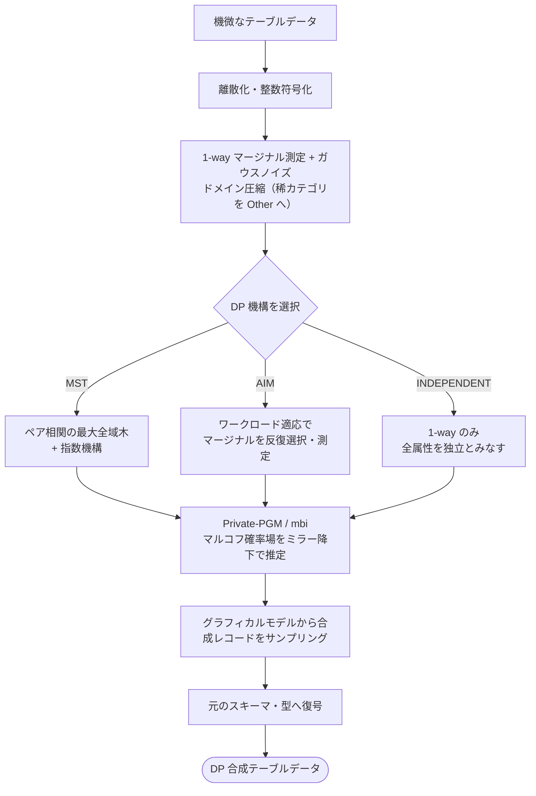

# API・CLI 利用ノート: DPSynth の使い方

本ページは [実証評価レポート](index.html) の付随資料であり、DPSynth の API・CLI の利用方法、属性型の定義、処理ライフサイクルをまとめる。
研究上の知見・評価結果はレポート本体を、環境構築は [環境構築ノート](setup.html) を参照のこと。

> 本ページのコード例は利用方法の説明を目的とする。出典タグ **[n]** はレポート本体の第10章「参考文献」に対応する。

---

## 1. 処理ライフサイクル(In-Memory の 5 段階)

`dpsynth.generate()` 内部は以下の 5 段階で動作する [\[5\]](index.html#ref5)[\[11\]](index.html#ref11)。

1. **離散化 (Discretization)**: 連続値は等頻度分位ビンに、オープン集合の文字列は DP パーティション選択で評価。
2. **整数符号化 (Integer Encoding)**: 全列を密な整数インデックス `[0, K-1]` に写像。
3. **ドメイン圧縮 (Compression)**: 1-way マージナルをガウスノイズ付きで測定し、稀なカテゴリを `"Other"` にまとめる。
4. **機構実行 (Mechanism)**: AIM / MST 等を実行。`mbi.MarkovRandomField` を Private-PGM のミラー降下で当てはめる。
5. **サンプリング & 逆変換**: グラフィカルモデルから合成整数レコードを生成し、元の型(文字列・整数・浮動小数)へ復号。



---

## 2. 属性型(スキーマ定義)

DPSynth は各列を 3 つの属性型のいずれかとして扱う [\[6\]](index.html#ref6)。

| 型 | 用途 | 例 |
|---|---|---|
| `CategoricalAttribute` | 取りうる値が既知の有限カテゴリ | 曜日、都道府県、真偽フラグ |
| `OpenSetCategoricalAttribute` | カテゴリ集合が未知/非有界(DP で値を発見) | 職種名、都市名 |
| `NumericalAttribute` | 連続値 or 順序付き整数(範囲指定) | 年齢、給与、取引額 |

---

## 3. In-Memory API: `dpsynth.generate`

```python
import dpsynth
from dpsynth import discrete_mechanisms as dm
from dpsynth import domain
import pandas as pd

df = pd.read_csv("sensitive.csv")

domains = {
    "age": domain.NumericalAttribute(min_value=17, max_value=90, dtype="int", clip_to_range=True),
    "education": domain.CategoricalAttribute(possible_values=sorted(df["education"].unique())),
    "occupation": domain.OpenSetCategoricalAttribute(default_value="Unknown"),
}

synthetic = dpsynth.generate(
    data=df,
    domains=domains,
    epsilon=1.0,
    delta=1e-5,
    discrete_config=dm.MSTConfig(seed=42),   # or AIMConfig / IndependentConfig
    numerical_bins=16,
)
synthetic.to_csv("synthetic.csv", index=False)
```

主な引数 [\[4\]](index.html#ref4): `epsilon` / `delta`(総予算)、`discrete_config`(機構)、`numerical_bins`(数値ビン数)、
`one_way_marginal_budget_fraction`(1-way 測定+圧縮に割く予算割合)、`cross_attribute_constraints`(列間制約)、`skip_compression`。

---

## 4. ドメイン定義(YAML)とCLI

YAML の解釈規則と CLI フラグは公式ドキュメント準拠 [\[6\]](index.html#ref6)[\[4\]](index.html#ref4)。

```yaml
# domain.yaml : possible_values→Categorical / min_value+max_value→Numerical / 空→OpenSet
workclass:
  possible_values: ["?", "Private", "Self-emp-not-inc", "Federal-gov"]
  out_of_domain_index: 0
age:
  min_value: 17.0
  max_value: 90.0
  dtype: "int"
  clip_to_range: true
occupation: {}
```

```bash
python3 bin/main.py \
  --dataset=data.csv --domain=domain.yaml \
  --epsilon=1.0 --delta=1e-8 \
  --mechanism=mst --seed=12345 \
  --output_path=/tmp/synthetic.csv
# --mechanism: mst | aim | independent | aim_gdp
```

---

## 5. Scalable Beam API（参考・本レポートでは未評価）

分散実行は `data_generation.generate` + `BeamBackend` を用いる [\[7\]](index.html#ref7)。
**本レポートの実験では未評価**であり、ここでは利用方法の参考として示す。

```python
import apache_beam as beam
from dpsynth import data_generation
from dpsynth.dataset_descriptors import csv_descriptor
import pipeline_dp

config = data_generation.DataGenerationConfig(
    epsilon=1.0, delta=1e-5,
    mechanism=data_generation.Mechanism.MST,
    dataset_descriptor=descriptor,
    num_out_records=1000,
)
with beam.Pipeline() as p:
    records = p | beam.io.ReadFromText("adult.csv", skip_header_lines=1) | beam.Map(parse)
    synthetic = data_generation.generate(input_data=records, config=config, backend=pipeline_dp.BeamBackend())
```

---

← [実証評価レポートに戻る](index.html)
